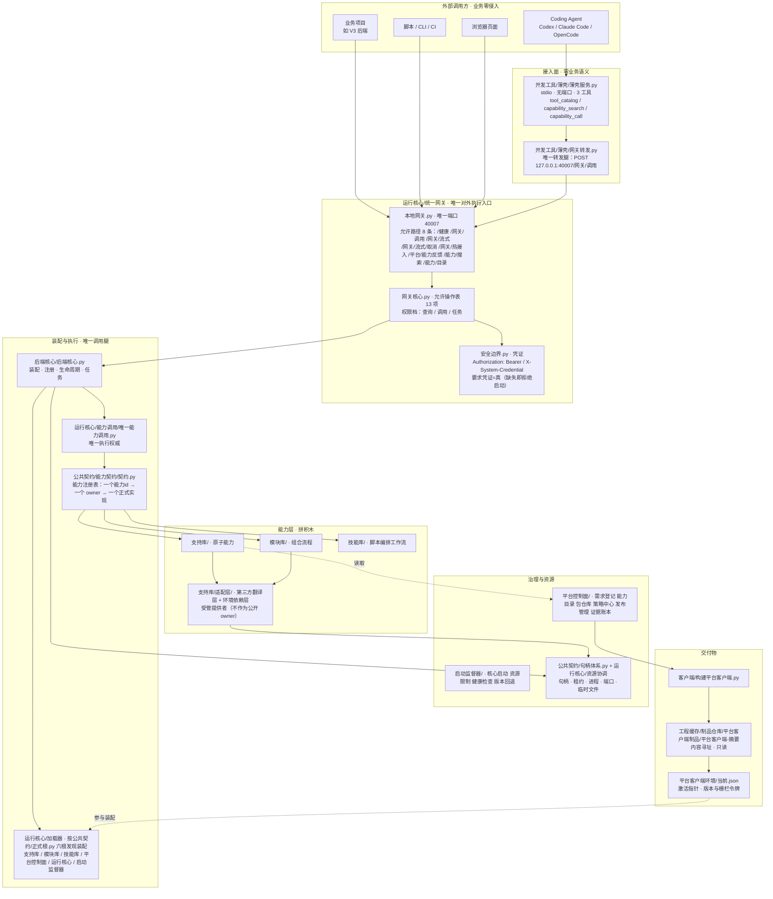

# 系统工程平台

与任何业务项目完全平级、完全独立的系统级工程底座：公共契约 → 支持库（原子能力/第三方边界）→ 模块库（组合流程）→ 项目适配层（绑定版本/配置/权限/路径/密钥引用与项目别名）→ 正式代码 → 运行核心（装载/调度/资源/调用/治理）→ 平台控制面（目录/策略/制品/发布/证据）。只依赖 Python 标准库。

## 这是什么（项目定位）

> **不是「所有业务都要建在上面的超级框架」，而是「整台机器只部署一套的能力总线」——
> 给 Coding Agent 用的能力操作系统。** 业务项目不复制、不 vendor、不维护底座。

### 一句话形态

```text
你的 Agent（Codex / Claude Code / OpenCode / 其它）
        │  永远只记 3 个工具：搜索能力 / 调用能力 / 工具目录
        ▼
   本平台（本机只跑一套，长期常驻）
        │
        ├→ 业务项目甲
        ├→ 业务项目乙
        └→ 业务项目丙
```

### 架构一图



> 完整 5 张图（分层 / 一次调用全链路 / 源码到制品到发布 / 任务与流式 / 句柄状态机）见
> [`开发文档/架构总览.md`](./开发文档/架构总览.md)；每张图的每个节点都标了真实落点 `文件:行号`。

### 三条铁律（定位的直接推论）

1. **中央部署一套**：整机只跑一套底座；业务项目**不复制平台代码**，也不把底座 vendor 进自己仓库。
2. **业务零侵入**：业务只经 HTTP / MCP 调能力；不 import 平台内部实现，不依赖平台目录结构。
3. **Agent 只记两个动作**：`搜索能力` → `调用能力`。Agent 不需要记住几百个能力，也不需要知道某个能力由哪个文件实现 —— 实现怎么改、搬到哪、换什么语言，Agent 不感知。这也是 MCP 薄壳**只暴露 3 个工具**的原因（能力多时把全量 schema 塞进上下文会直接污染 Agent 上下文），见 `## 启动平台 MCP`。

### 这个定位隔离的是什么

| 会漂移的东西 | 谁隔离它 | 现状 |
|---|---|---|
| **实现漂移**：文件路径、模块名、语言、第三方依赖 | 网关 + 能力 id | 已成立 |
| **接口漂移**：能力 id 改名、参数/返回结构变化 | **契约版本** | 部分成立（见下） |

### 为什么这对 Agent 特别有价值

人类写程序 `from xxx import read_file` 已经很顺手；**Agent 不一样** —— 它最大的问题是
**不知道你有什么、不知道该复用什么、不知道在哪**；今天记住了，下一轮上下文又没了，于是不停重新造轮子。
给它一个「找」+「用」，它不需要记住 600 个工具，只需要记住两个动作。

### 不承诺的事（把边界说清）

- **不承诺「clone 下来永远零维护」**：依赖锁锁 `macOS / arm64 / Python 3.14.x`，换平台需按当前环境重建锁
  （见 `### 换平台`）；**当前无 Docker、无一键安装脚本**。
- **「接口不漂移」依赖两条纪律**：能力 id 稳定 + 契约版本化。当前是**纪律 + 部分机制**，
  完整门禁仍在补。能力 id 历史上**改过名**，改一次会波及消费者契约、验证场景与测试夹具 ——
  因此调用方**不要硬编码能力 id 常量**，按「搜索 → 取 id → 调用」走。
- **多实例/分布式不在范围内**：本平台是**单机私有部署**，限流与状态治理按**进程内 + 本机权威状态**实现。

### 当前支持矩阵（如实标注，2026-09-17）

| 平台 | 状态 | 依据 |
|---|---|---|
| **macOS / arm64 / Python 3.14.x** | **完整可用** | 维护者开发与发布环境；依赖锁按此锁定；环境自检 / 装配冒烟 / HTML 黑盒 / 发布门禁均在此实测 |
| Linux / x86_64 | **未验收** | 代码层已尽量走 `公共契约/运行时/` 收口层，但**无验收记录** |
| **Windows / x64** | **未完成** | 三条链路仍是 POSIX 专有实现（见下），且 `公共契约/运行时/平台适配.py` 自述「本模块的 Windows 分支**未经真机实测**」 |

**Windows 未完成的三条链路**（从代码即可判定，不是"待验证"）：

1. **流式断连监视**：`运行核心/统一网关/流式HTTP.py::消费上行字节` 用 `socket.MSG_DONTWAIT`，该常量在 Windows 不存在且**无兜底**。
2. **端口归属枚举**：`公共契约/句柄体系.py` 依赖 `lsof`（缺失时给明确失败说明，但**没有 `netstat -ano` 回退**），Windows 上该路径降级。
3. **热接入脚本**：`运维脚本/热接入.py` 依赖 `bash` / `pgrep` / LaunchAgents `plist`，Windows 不可用（可改走 HTTP `POST /网关/热接入`，见 `## 编译、验证与发布`）。

**另一条与平台无关的通用缺口（2026-09-17 已修）**：`运行核心/能力调用/HTTP连接器.py` 已支持网关凭证 ——
构造函数新增 `凭证` / `凭证环境变量` 两个**可选**参数，请求与健康检查都会携带 `Authorization: Bearer <凭证>`；
**不配凭证时行为与旧版完全一致**（兼容 `要求凭证=False` 的本地网关）。未配凭证而网关要求凭证时，
会明确返回「本连接器未配置 `凭证` / `凭证环境变量`」而不是含糊的 401。非 MCP 薄壳的调用方（业务引擎、脚本、CI）现在可以正常接入。

> 要声称某个平台可用，请先在那个平台上跑通并**留下证据**（环境自检 + 装配冒烟 + 黑盒/门禁输出）。
> **不允许把"文档里写了跨平台"当成"跨平台可用"** —— 这正是这个仓库历史上最危险的形态。

### 外部贡献（可提交 PR）

**欢迎的贡献形态**（按本平台定位推导，不是随意开放的）：

| 收 | 不收 |
|---|---|
| **新增能力包**：`支持库/`（原子能力）、`模块库/`（代码组合流程）、`技能库/`（脚本编排流程） | 改平台底座核心（`运行核心/` `公共契约/` `平台控制面/`）**以求「我的项目能跑」** —— 那说明能力层没封装对 |
| **真实缺陷修复**：附复现步骤 + 修复前后的真实证据 | 业务实现进底座：业务库 schema、账号库、密钥明文、实盘交易通道（**红线，永不进底座**） |
| **验证场景 / 测试补充**：给现有能力补真实正向或负向场景 | 放宽断言、加 `skipTest`、或「只 print 不断言」式的假绿 |
| **文档纠错**：说明与实际实现不符之处（这条尤其欢迎） | 第二套事实源：同一件事在两个地方各写一份 |

**硬门槛（PR 必须自证，不接受「我这儿能跑」）**：

1. **全中文命名**：变量 / 函数 / 类 / 文件 / 目录 / 注释 / 文档（只保留 `id`、`MCP`、`OCR` 这类人人认识的缩写）。
2. **三层落位判定**：一次调用出结果 → **模块库**；要落盘 / 要续跑 / 要人审 → **技能库**；单一动作不组合 → **支持库**。
3. **包要素齐备**：`包声明.json` + `能力契约/参数契约.json` + `能力定义.json` + `权限契约` + 资源预算 + `能力数据/` + 验证场景 + `说明/` + `__init__.py`。
4. **验证场景合规**：每个公开能力都要有**真实正向目标步骤**（不是"跑得过就行"，见 `--覆盖` 自检）；负向断言必须声明错误码；入参不得出现静态绝对路径或 `..`（越界用例换写法触发，见 `开发文档/决策记录/0016`）。
5. **提交前自己先跑这套**（跑不过就别提；维护者复核的也是这套）：

   ```bash
   python3.14 -m 开发工具.环境自检                          # 有【不支持】项即非零退出
   python3.14 开发工具/验证场景体检.py                       # 场景格式，0 不合格
   python3.14 开发工具/验证场景体检.py --覆盖 <制品目录>       # 能力全覆盖，不得有「缺目标」
   python3.14 客户端/构建平台客户端.py                        # 编译（含写盘后自校验）
   python3.14 开发工具/发布门禁/运行发布门禁.py --制品 <制品目录>       # 最终以它为准
   ```

   > **黑盒验证不要直接跑验证器**（`python3.14 -m 开发工具.HTML验证.验证器 …`）：
   > 制品进程的 `cwd` 就是**制品目录**，没有受管缓存环境时它会把运行态（`工程缓存/`、权威状态库、
   > 模型日志、私钥探测物）**写进制品目录**，直接导致「制品摘要前后不一致 / 待验证制品字节不变」假红。
   > **发布门禁会先调 `构建验证缓存环境()`**，把 `TMPDIR`、`PYTHONPYCACHEPREFIX`、`系统底座_工程缓存根`
   > 等指到制品外的受管临时目录 —— 所以验制品只走门禁这一条路。
   > 若要单独跑黑盒，必须自己复刻那组环境变量。

6. **反向验证**：动到判据 / 门禁 / 检测器时，必须附「**故意弄坏 → 它确实变红**」的证据（这是本仓库的固定纪律，门禁自己也不例外）。
7. **提交纪律**：不要 `git add -A`（只加自己确实改过的精确路径）；临时脚本只落 `/tmp`，**禁止落进 `工程缓存/`**；提交信息写清「改了什么 / 为什么 / 怎么验的」。

**维护者保留的裁定权**：分层归属（支持库 / 模块库 / 技能库）、能力 id 命名口径、契约与错误码口径、以及**某一个能力到底收不收** —— 最终由维护者裁定。
不符合上述门槛的 PR 会被要求整改或关闭。**这不是不欢迎，而是底座的唯一性（唯一网关 / 唯一注册表 / 唯一事实源）靠它维持**。

**新增能力的正规流程**（不是放个文件就能注册）：

```text
需求登记 → 能力搜索确认无重复（同一能力 id 全局唯一，重复注册期即拒）
        → 包声明 + 参数契约（严格类型，双精度必须 30.0 不能 30）
        → 验证场景 + 测试
        → 编译（契约 / 依赖 / 边界 / 能力登记）
        → 发布门禁（编译产物 + HTML 真实请求 + 反向验证）
        → 热接入生效（增量装配，免重启；单包失败保持旧版继续跑）
```

## 目录约定的两点说明（2026-09-16 自裁，见 `开发文档/未完成事项.md` H2 段）

- **单文件顶层目录合法**：`客户端/`、`运维脚本/`、`后端核心/` 等单文件目录**不算缺陷**，它们对应一个独立职责；不为「目录里文件太少」做 import 前缀大迁移。
- **`模块库` 含平台自用工具模块**：`能力目录`、`测试资源`、`组件生成`、`自修复工具` 四个模块是**平台自己的工具流程**（组合公开能力完成闭环），不是业务模块；调用方别把它们当业务能力用。

## 唯一调用边界

```text
正式代码
  → 项目适配层、统一网关或统一能力服务
  → 模块公开能力（模块只保存能力 id/契约版本，不静态导入支持库/提供者）
  → 运行核心注入的唯一能力调用器 → 能力注册表解析支持库能力
  → 锁定提供者与受管执行单元
  → 数据库、服务器、DLL、操作系统、第三方库或外部协议
```

支持库负责原子能力和底层转换，模块负责组合流程，项目适配层负责项目配置、依赖锁和外部资源绑定，正式代码只处理统一结果（成功/值/错误码/错误说明）。数据库联通、服务器健康、DLL 存在性和外部协议检查都必须在适配层完成，不得泄漏到底层实现或正式代码。

## 目录

| 目录 | 职责 |
|------|------|
| 公共契约/ | 包声明、能力契约、基础类型、错误结构、生命周期、版本规则 |
| 平台控制面/ | 需求登记、能力目录、包仓库、策略中心、发布管理、证据账本（唯一写权威） |
| 启动监督器/ | 核心启动、资源限制、健康检查、版本切换与核心回退 |
| 运行核心/ | 加载器、任务调度、资源协调、能力调用、统一网关、运行诊断、依赖防火墙、运行环境管理器、环境指纹 |
| 前端核心/ | 窗口、页面、组件、状态、事件、路由和渲染宿主 |
| 后端核心/ | 后端执行单元、请求上下文、能力执行和宿主级生命周期 |
| 支持库/ | 后端原子支持库、前端描述模型、适配层（第三方/系统/外部协议边界） |
| 模块库/ | 只组合支持库完成功能的样板模块 |
| 技能库/ | 脚本编排工作流（要落盘 / 要续跑 / 要人审的能力组合） |
| 项目适配层/ | 项目声明、配置合并、依赖锁定、模块绑定、运行入口 |
| 开发工具/ | 统一能力入口、能力搜索、说明书生成、契约编译、组件规范、组件合规、复用审计、发布门禁、统一验证 |
| 测试中心/ | 独立测试环境（unittest），唯一测试代码位置 |
| 示例项目/ | 最小运行样板 |
| 客户端/ | 平台客户端制品构建脚本 |
| 开发工具/薄壳/ | 平台 MCP stdio 薄壳（3 工具、无端口；agent 接入面） |
| 开发文档/ | 当前版本说明、架构/能力契约、决策记录与参考资料（含外部源码研究）；运行验证只保留机器账本 |
| 运维脚本/ | 热接入等运维动作脚本 |
| 工程缓存/ | 生成物（可删除） |

## 边界铁律

- 支持库只提供原子能力；模块只组合支持库；加载器只负责发现/解析/装载/生命周期；核心只负责装载、调度、资源、调用和运行治理。
- 模块只能经支持库公开入口（`__init__.py`）调用，禁止深入实现目录。
- 只允许 Python 标准库；第三方库必须封装在 `支持库/适配层/` 对应提供者。
- 严禁导入、引用、读取任何业务项目代码、数据库、配置与运行数据。
- 外部适配层只能把外部技术转换为公共支持库契约，不得包含业务流程。
- 项目适配层只能绑定项目环境，不得复制支持库和模块实现。

## 编译、验证与发布

正式发布只认同一待发布制品的 HTML 真实请求和发布门禁：

```bash
python3.14 -m 开发工具.HTML验证.验证器 --制品 <待发布制品目录> --并发 8
python3.14 开发工具/发布门禁/运行发布门禁.py
python3.14 开发工具/能力搜索/能力搜索器.py --能力 读取文件
# 第 4 条必须先注入网关凭证：它按生产构造器起本地网关（默认要求凭证），
# 缺变量时第 5 步即以「缺失凭证: 环境变量 系统库网关凭证 未设置」失败。
# bash 不支持中文变量名，必须用 env 传；本机默认从 40007 的 plist 读。
env 系统库网关凭证="$(plutil -extract EnvironmentVariables.系统库网关凭证 raw -o - ~/Library/LaunchAgents/com.huashi.gateway-40007.plist)" python3.14 示例项目/适配层示例/运行入口/运行.py
```

能力网关采用渐进读取：首次只请求 `能力目录`，选中包后请求 `包详情`，真正准备调用某项能力时才请求 `能力详情`，最后以 `调用能力` 执行。目录项简介不超过 60 字，不在首次响应中加载参数、依赖、资源预算或调用示例。

> 开发期回归只按明确的 `python3.14 -m unittest 测试中心.<...>` 模块入口执行；
> 正式结论必须来自编译产物的真实 HTTP 场景和发布门禁，不能用单元测试数量替代。
> 第 4 条 `示例项目/适配层示例/运行入口/运行.py` 自带 1–8 步断言，装配失败会打印原因并以非零退出；
> 但它**不检查 `装配跳过包`**（有包被跳过时仍可能返回 0），要判断是否漏装包请用「部署」第 3 步的冒烟断言。
> **2026-09-16 实测**：注入凭证后 [1]–[5] 通过（装配 625 个能力），但第 [6] 步经项目入口的三个调用仍返回
> `权限不足 / 访问凭证缺失或无效`、真实退出码 **1** —— 根因是当时 `运行核心/能力调用/HTTP连接器.py`
> 不发送 `Authorization` 头（`开发工具/统一验证/统一验证器.py` 当时走 `{"要求凭证": False}` 的显式免凭证配置，故不受影响）。
> **该根因已于 2026-09-17 修复**（连接器已支持 `凭证` / `凭证环境变量`，见上「当前支持矩阵」）；
> 上面这段保留为**当时的实测记录**，不代表当前行为。

## 部署

前提（三条都要对得上；不符时装配会 **fail-closed 并点名差异**，不会静默降级）：

- **解释器必须用 `python3.14`**：本机 `python3` 是 3.9，会被依赖锁直接阻断——所有装配与验证命令都不能用它跑。
- **依赖锁当前锁 `macOS / arm64`（32 份；纯标准库包不建锁）**（本项目在 macOS（Apple Silicon）上开发与验证）：换到 Windows、Linux 或 x86 机器，先按当前环境重建依赖锁再运行。所谓「环境对得上就能部署」，对的就是这一条。锁文件自带证据：`支持库/适配层/*/依赖锁.json` 的 `环境` 字段写明 `Python 3.14.4 / macOS / CPU arm64`。
- 第三方包由 `支持库/适配层` 的提供者按依赖锁声明自行安装。

下面命令都在**仓库根目录**执行。

```bash
# 1. 取代码
git clone https://github.com/kunhua-he/system-engineering-platform.git 系统工程平台 && cd 系统工程平台

# 2. 确认 Python 与依赖锁一致（并逐项体检本机：解释器/平台与架构/依赖锁/收口层能力与真跑/
#    POSIX 专有参数/中文环境变量名/装配冒烟/外部命令；有【不支持】项即非零退出，加 --json 机器读）
python3.14 -V
python3.14 -m 开发工具.环境自检

# 3. 装配冒烟（纯标准库，不需要先装任何第三方包；装配不健康即非零退出）
python3.14 -c '
import sys
from pathlib import Path
from 后端核心.后端核心 import 后端核心

# 真断言：结果.成功 且 能力数 > 0 且 无跳过包；任一不满足即 exit 1
b = 后端核心(Path("."))
装配 = b.启动()
快照 = b.状态快照()
状态 = 快照["状态"]
能力数 = 快照["能力数"]
跳过 = 快照["装配跳过包"]
print("[装配冒烟] 状态=" + 状态 + " 能力数=" + str(能力数) + " 跳过包=" + str(len(跳过)))

问题 = []
if not 装配.成功:
    问题.append("装配失败（" + str(装配.错误码) + "）：" + str(装配.错误说明))
if 能力数 <= 0:
    问题.append("能力数为 " + str(能力数) + "：一个能力都没装配出来，不能算部署成功")
if 跳过:
    问题.append("有 " + str(len(跳过)) + " 个包被跳过：" + "；".join(跳过))
if 问题:
    for 项 in 问题:
        print("[装配冒烟] 失败：" + 项, file=sys.stderr)
    sys.exit(1)
print("[装配冒烟] 通过：装配成功、能力数 > 0、无跳过包")
'

# 4. 起常驻唯一网关（可选；默认 127.0.0.1:40007）
#    默认「要求凭证=真」：必须先注入凭证，否则网关直接拒绝启动（fail-closed）。
#    bash 不支持中文变量名，必须用 env 传；本机默认从 40007 的 plist 读。
env 系统库网关凭证="$(plutil -extract EnvironmentVariables.系统库网关凭证 raw -o - ~/Library/LaunchAgents/com.huashi.gateway-40007.plist)" \
    python3.14 运行核心/启动运行核心网关.py
```

### 换端口 / 换地址（默认 `127.0.0.1:40007`）

`40007` 只是**本仓库的默认值**，不是必须的；两处可改，都不需要动业务代码：

- **启动网关时**：`运行核心/启动运行核心网关.py` 末尾构造处传参（`端口=` / `地址=`）；
- **调用方**：`运行核心/能力调用/HTTP连接器.py` 的构造函数已把 `网关地址` / `网关端口` 作为**可覆盖参数**（默认 `127.0.0.1:40007`），按你的部署地址传即可。

### 换平台（Windows / Linux / x86）

依赖锁里写明了环境指纹（`Python 3.14.4 / macOS / CPU arm64`）。换平台后**不要手改锁 JSON**，要按当前环境重建锁；重建入口见 `开发文档/项目说明.md` 与仓库内的重建工具（若当前版本尚未提供，按 `支持库/适配层/*/依赖锁.json` 的 `环境` 字段结构对齐）。

### 运行时数据落在哪（不需要手工建库）

装配与运行会在 `工程缓存/` 下**自动创建** SQLite 运行库（如 `工程缓存/权威状态/权威状态.db`、`工程缓存/运行数据/底座运行.db`）；该目录**已加入 `.gitignore`、不进仓库**。仓库里带的 `*.db` 只在各包的 `验证夹具/`、`夹具/` 目录下，是测试用夹具（含 0 字节占位文件），**不含任何真实数据**。

冒烟命令是**真断言**，不是「打印出一个数字就算过」：`启动()` 返回的 `结果.成功` 为真、`能力数 > 0`、`装配跳过包` 为空，三条全满足才打印 `[装配冒烟] 通过` 并以 exit 0 结束；任一条不满足就逐条把原因打到 stderr 并以 **exit 1** 结束。**只 print 能力数、不判退出码的写法会掩盖失败**：整体装配失败只装配出 0 个能力、或有包被跳过时，那种写法照样打印一个数字并返回 0，让人误以为部署成功。

- 平台面向**本地私有部署**（哲学第 9 条 5 项）：安全边界是**相对安全**、由使用者自行拿捏，底座只守「不造成系统性破坏」的底线。
- 机器专属配置（客户端接入路径等）不写死在本仓库：仓内的 `opencode.json` / `.mcp.json` 只作本机样例，按自己机器的路径改，或另存本机副本。
- 客户端（Agent）接入见下一节「启动平台 MCP」。

## 启动平台 MCP

平台 MCP 为单一对外网关（`system_engineering_toolkit`）：**stdio 薄壳，无 HTTP 端口**。

```bash
python3.14 开发工具/薄壳/薄壳服务.py   # 由 MCP 客户端以 stdio 方式拉起
```

客户端配置：根目录 `opencode.json`（opencode，路径用 `{env:HOME}` 插值）与 `.mcp.json`（Claude Code，路径用 `${HOME}` 插值）；网关凭证经环境变量 `MCP_GATEWAY_TOKEN` 注入，**不写进配置文件**。

> 历史口径（已失效，勿再沿用）：8766 HTTP MCP（Streamable HTTP）已于 2026-09-15 随 D 清场下线，仓库不再提供 remote HTTP 接入。

## 项目硬规则

完整项目硬规则见 `AGENTS.md`：分层 MCP 与子代理继承协议、唯一分层方案、
验收门禁、铁律、目录约定、每个支持库必备要素与系统适配器豁免、验证命令。
