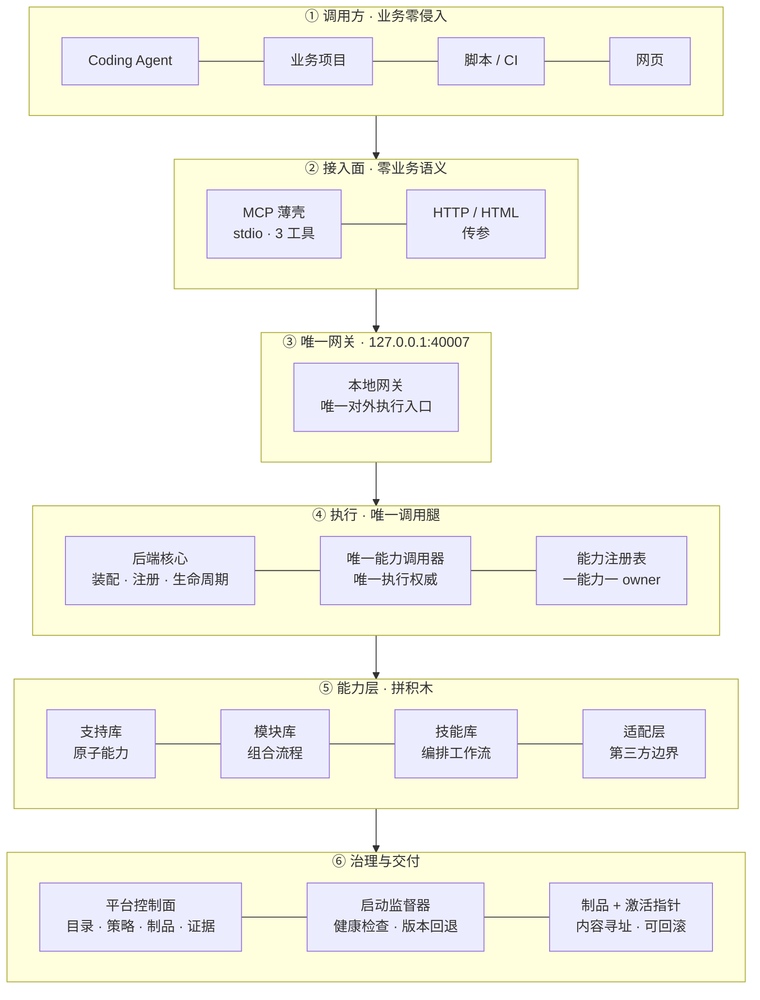
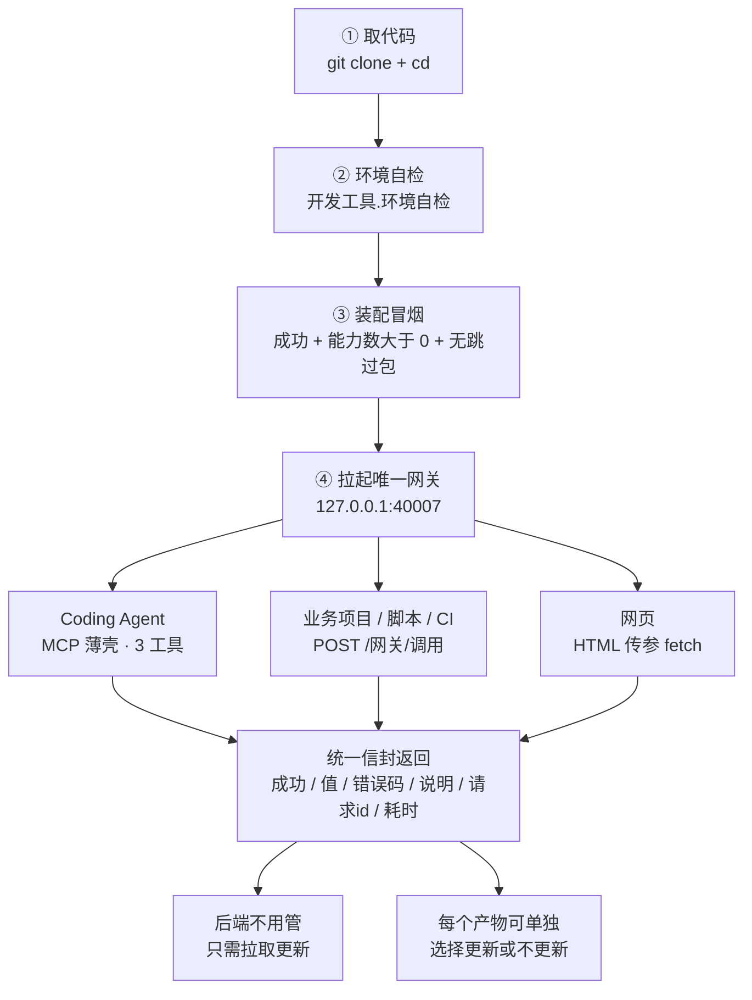
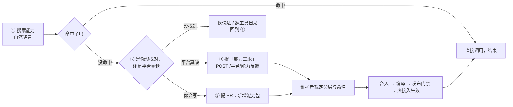

# 系统工程平台

> 最后更新：2026-09-24
> 口径：实测（**只写不变式与取证命令，不写会漂的具体数字**；包数/能力数/提交数/场景数每建一个包就变，引用前必须重跑取证命令）
> 维护者：对外定位（唯一权威处）
<!-- 机器管理｜类型：权威文档｜生成器：开发工具.MD文档生成 -->


与任何业务项目完全平级、完全独立的系统级工程底座：公共契约 → 支持库（原子能力/第三方边界）→ 模块库（组合流程）→ 项目适配层（绑定版本/配置/权限/路径/密钥引用与项目别名）→ 正式代码 → 运行核心（装载/调度/资源/调用/治理）→ 平台控制面（目录/策略/制品/发布/证据）。只依赖 Python 标准库。

**给 Agent 的定位一句话**：它是 **systemd + launchd + Homebrew + REST Gateway 四合一** —— 装能力、管生命周期、按唯一网关传参调用；
**一套代码靠配置切部署形态**（个人本机零配置启动 ↔ 服务商集中部署给多人用），不做双产品线。

**当前规模：本文不写死数字**（包数、能力数、提交数、场景数随建包与提交逐分钟在变，写死必漂）；
要看数就跑下表右列的取证命令，或看文末「审计者事实基线」——每条都能一分钟自证。

| 指标 | 取证命令（数字以该命令现场输出为准） |
|---|---|
| 正式公开能力数 | 「部署」第 3 步装配冒烟（读 `能力数` 字段，真断言 + 退出码） |
| 包数 / 分层 | `find . -name 包声明.json -not -path './工程缓存/*' \| wc -l` |
| 包级验证场景 | `python3.14 开发工具/发布门禁/运行发布门禁.py --制品 <制品目录>`（门禁现场输出的场景数） |
| 依赖锁（第三方边界，全部锁到具体版本） | `find 支持库 -name 依赖锁.json \| wc -l` |
| 外部调用入口 | `rg -n '"/' 运行核心/统一网关/本地网关.py`、`rg -n "允许操作表" 运行核心/统一网关/网关核心.py` |
| 提交历史 | `git rev-list --count HEAD` |

> **快速导航**：想部署 → 「部署」（含四步命令）；想调用 → 「怎么调用」+「唯一调用边界」；
> 想更新产物 → 「产物更新策略」+「版本控制」；想加能力 → 「外部贡献」；
> 来审计 → 文末「审计者事实基线」（每条事实带取证命令）。

## 它解决什么问题

人工写代码的比重已经大幅下降，**真正的瓶颈转移到了「Agent 反复写重复代码」**：

- Agent **不知道你有什么**：没有可发现的能力目录，只能靠上下文里塞文档；
- Agent **不知道该复用什么**：每个项目重写一遍读文件、转 PDF、转码、连库；
- Agent **不知道在哪**：记住了路径，下一轮上下文就没了，于是重新造轮子；
- 业务资源（数据库、服务器、第三方服务）的接入方式**散落在各项目里**，各写各的。

这个项目的答案只有一句话：

```text
部署本项目 → 拉起唯一网关 → Agent 用 HTML / HTTP 传参过去 → 拿结果
```

- **不需要自己写那么多代码**：能力是已注册、已契约化、已验证的积木；
- **业务资源也是传参**：数据库、服务器、外部协议的接入被封装在**适配层**，调用方只传参数；
- **所有信息本机运行**：单机私有部署，不出网、不落云；
- **后端不用管**：平台本质上只是「拉取更新 + 拉起网关」。

## 这是什么（项目定位）

> **不是「所有业务都要建在上面的超级框架」，而是「整台机器只部署一套的能力总线」——
> 给 Coding Agent 用的能力操作系统。** 业务项目不复制、不 vendor、不维护底座。

### 一句话形态

```text
你的 Agent（Codex / Claude Code / OpenCode / 其它）
        │  永远只记 3 个工具：搜索能力 / 调用能力 / 工具目录
        ▼
   本平台（本机只跑一套，长期常驻）
        │
        ├→ 业务项目 A（后端 / 引擎）
        ├→ 业务项目 B（脚本 / CI）
        └→ 业务项目 C（网页 / 小工具）
```

### 架构一图（六层，从上往下读）



**每层的真实落点**（图里只画层与职责，文件名看这张表）：

| 层 | 真实落点 | 关键约束 |
|---|---|---|
| ① 调用方 | —（Agent / 业务 / 脚本 / 页面） | 只发请求，不 import 平台实现 |
| ② 接入面 | `开发工具/薄壳/薄壳服务.py`、`开发工具/薄壳/网关转发.py` | MCP 只有 3 个工具；HTTP / HTML 传参到同一网关 |
| ③ 唯一网关 | `运行核心/统一网关/本地网关.py`（网关核心、安全边界是它的**内部件**） | 对外只有一个入口、一个端口。**调用方不需要知道内部怎么分层**；凭证缺失即拒绝启动 |
| ④ 执行 | `后端核心/后端核心.py`、`运行核心/能力调用/唯一能力调用.py`、`公共契约/能力契约/契约.py` | 一个能力 id → 一个 owner → 一个正式实现；不允许第二执行腿 |
| ⑤ 能力层 | `支持库/`、`模块库/`、`技能库/`、`支持库/适配层/` | 支持库原子；模块只组合；技能负责编排；适配层是第三方边界 |
| ⑥ 治理与交付 | `平台控制面/`、`启动监督器/`、`客户端/构建平台客户端.py` | 目录 / 策略 / 制品 / 发布 / 证据；热接入免重启 |

> 完整 5 张图（分层 / 一次调用全链路 / 源码到制品到发布 / 任务与流式 / 句柄状态机）见
> [`开发文档/架构总览.md`](./开发文档/架构总览.md)；每张图的每个节点都标了真实落点 `文件:行号`。

### 三条定位推论（原「三条铁律」；与根 `AGENTS.md` 的《三条铁律》同名不同义，2026-09-23 改名收口）

1. **中央部署一套**：整机只跑一套底座；业务项目**不复制平台代码**，也不把底座 vendor 进自己仓库。
2. **业务零侵入**：业务只经 HTTP / MCP 调能力；不 import 平台内部实现，不依赖平台目录结构。
3. **Agent 只记两个动作**：`搜索能力` → `调用能力`。Agent 不需要记住几百个能力，也不需要知道某个能力由哪个文件实现 —— 实现怎么改、搬到哪、换什么语言，Agent 不感知。这也是 MCP 薄壳**只暴露 3 个工具**的原因（能力多时把全量 schema 塞进上下文会直接污染 Agent 上下文），见 `## 启动平台 MCP`。

### 这个定位隔离的是什么

| 会漂移的东西 | 谁隔离它 | 现状 |
|---|---|---|
| **实现漂移**：文件路径、模块名、语言、第三方依赖 | 网关 + 能力 id | 已成立 |
| **接口漂移**：能力 id 改名、参数/返回结构变化 | **契约版本** | 部分成立（见下） |

### 为什么这对 Agent 特别有价值

人类写程序 `from xxx import read_file` 已经很顺手；**Agent 不一样** —— 它最大的问题是
**不知道你有什么、不知道该复用什么、不知道在哪**；今天记住了，下一轮上下文又没了，于是不停重新造轮子。
给它一个「找」+「用」，它不需要记住几百个工具，只需要记住两个动作。

## 你只需要记两个动作

| 动作 | 你要做的 | 平台返还的 |
|---|---|---|
| **搜索能力** | 用自然语言说你要干什么（例：`解码图像`、`把视频转成音频`） | 命中能力列表：能力 id、版本、简介、参数类型、调用示例 |
| **调用能力** | 传能力 id + 参数（**传参就用，不写实现**） | 统一信封：`成功 / 值 / 错误码 / 错误说明 / 请求id / 耗时毫秒` |
| **工具目录**（可选） | 要看全貌时列清单 | 包 → 能力的分级目录（渐进读取，首次只给极简简介） |

## 它现在能做什么（能力地图）

下表是**支持库 + 模块库 + 技能库**的公开能力（组网规模数以 `python3.14 开发工具/发布门禁/运行发布门禁.py --制品 <制品目录>` 现场输出为准；
括号里只写**能力域构成**，不写会随建包变化的总条数）。
每组都能现场核：用关键词搜一下就有真实条目。

| 你想干的事 | 能力域 | 代表能力（真实能力 id） |
|---|---|---|
| 读写文件、搜文件内容 | 文件系统支持库 | `文件系统支持库.文件操作.读取文件`、`.写入文件`、`.正则搜索` |
| 处理 Word / Excel / PPT / PDF | 办公文档支持库、文档转换支持库 | `办公文档支持库.文档生成.生成DOCX`、`.生成XLSX`、`.生成PPTX`、`文档转换支持库.PDF文本表格.提取表格` |
| 图片识别与处理 | OCR识别支持库、图像处理支持库 | `OCR识别.识别图片`、`图像处理支持库.图像解码.生成缩略图` |
| 音视频处理 | 媒体处理支持库 | `媒体处理支持库.FFmpeg媒体.探测媒体`、`.转码`、`.提取音频`、`.抽取帧` |
| 语音转文字 | 转写支持库 | `转写支持库.转写.转写音频文件` |
| 调大模型 | 大语言模型支持库 | `大语言模型支持库.模型连接器.生成对话`、`.上下文压缩.压缩历史`、`.重排服务.重排` |
| 连数据库 | 数据库连接支持库 | `数据库连接支持库.SQLite数据库.事务执行`、`.初始化运行数据库` |
| 用 Git | 版本控制支持库 | `版本控制支持库.Git操作.提交`、`.创建工作区`、`.回滚`、`.当前状态` |
| 发请求、抓网页 | 网络通信支持库 | `网络通信支持库.请求.发送请求`、`.网页解析.提取网页正文` |
| 看代码结构 | 代码解析支持库 | `代码解析支持库.解析代码文件`、`.代码地图.查询节点` |
| 并发与排队 | 并发控制支持库 | `并发控制支持库.lane排入`、`.lane领取`、`.lane完成` |
| 安全守卫 | 系统核心支持库 | `系统核心支持库.命令安全.检测危险命令`、`.协议白名单.校验端点` |
| 浏览器自动化 | 浏览器自动化支持库 | `浏览器自动化.导航页面`、`.读取页面`、`.获取截图` |
| 组合流程（一步出结果） | 模块库（`数据操作支持库` + `文件管理` / `OCR` / `直播逐字稿` 等模块域） | `OCR.识别图片文字`、`文件管理.写入文件`、`直播逐字稿.全自动精校` |
| 第三方技术接入 | 适配层提供者 | `FFmpeg媒体.转码`、`LibreOffice转换.转换办公文件`、`PDF渲染.渲染整页` |

### 真实调用长什么样（本机实测输出，不是编的）

```bash
# ① 读一个文件
curl -s -X POST http://127.0.0.1:40007/网关/调用 \
  -H "Authorization: Bearer $系统库网关凭证" -H "Content-Type: application/json" \
  -d '{"能力id":"文件系统支持库.文件操作.读取文件","参数":{"文件路径":"/tmp/示例.txt"},"权限档":"调用"}'
# → {"成功": true, "值": "系统工程平台：传参即用，不写实现。\n", "错误码": "", "耗时毫秒": 1.11}

# ② 探测一个视频（真实 mp4）
# → {"成功": true, "值": {"时长秒": 162.47, "格式": "mov,mp4,m4a,3gp,3g2,mj2", "大小字节": 10445216,
#      "比特率": 514320, "流": [{"类型": "video", "编码": "h264", "宽度": 448, "高度": 960},
#                              {"类型": "audio", "编码": "aac", "采样率": "44100", "声道数": 2}]}, "耗时毫秒": 73.31}

# ③ 参数写错了，它如实报错（不猜、不静默降级）
# → {"成功": false, "值": null, "错误码": "参数不合法",
#    "错误说明": "参数不合法：能力 文件系统支持库.文件操作.读取文件 缺少必填参数 文件路径"}
```

> 注意第 ③ 条：**它不会替你猜参数**。参数名、类型、必填由契约冻结，对不上就直接返回明确错误码 ——
> 这正是「契约化」的好处：Agent 拿到错误也能自己改对，不需要人介入。

## 整项目流程图

### 图 A：部署与接入（四步走到能用）



> **图 A 的三个要点**：① 后端**不用管** —— 平台对业务方而言只是「拉取更新 + 网关常驻」；
> ② **每个产物可选择更新或不更新**（见[产物更新策略](#产物更新策略每个产物可选择更新或不更新)）；
> ③ 调用只有**一条腿**：任何调用方最终都是打同一个网关的同一批路径。

### 图 B：一次调用真正发生了什么

```text
调用方（Agent / 业务 / 脚本 / 页面）
   │  POST /网关/调用   {能力id, 参数}
   ▼
本地网关（唯一端口 40007）→ 网关核心（校验「允许路径 + 允许操作表 + 权限档」）→ 安全边界（凭证）
   ▼
后端核心：装配 / 注册 / 生命周期 / 任务
   ▼
唯一能力调用器（运行核心/能力调用/唯一能力调用.py）
   ▼
能力注册表（公共契约/能力契约/契约.py）：一个能力id → 一个 owner → 一个正式实现
   ▼
支持库原子能力 / 模块组合流程 / 技能编排   ←→   适配层提供者（第三方 / 系统 / 外部协议）
   ▼
数据库、服务器、DLL、操作系统、第三方库或外部协议
```

### 图 C：能力不够用怎么办（三步定性）



> 热接入是**增量装配、免重启**；单包失败保持旧版继续跑。详见[外部贡献](#外部贡献可提交-pr)。

## 怎么调用（HTTP / MCP / HTML 传参）

### HTTP（业务项目、脚本、CI）

```bash
curl -s -X POST http://127.0.0.1:40007/网关/调用 \
  -H "Authorization: Bearer $系统库网关凭证" \
  -H "Content-Type: application/json" \
  -d '{"能力id":"<搜索到的能力id>","参数":{ },"权限档":"调用"}'
```

返回统一信封：`成功 / 值 / 错误码 / 错误说明 / 请求id / 耗时毫秒 / 请求版本 / 当前版本 / 版本差异`。

### HTML 传参（页面工具 / 零依赖前端）

页面直接 `fetch` 同一个网关即可，**不需要任何前端框架**：

```html
<script>
fetch("http://127.0.0.1:40007/网关/调用", {
  method: "POST",
  headers: {"Content-Type": "application/json", "Authorization": "Bearer " + 令牌},
  body: JSON.stringify({能力id: "<搜索到的能力id>", 参数: { }, 权限档: "调用"})
}).then(r => r.json()).then(信封 => {
  if (!信封.成功) throw new Error(信封.错误码 + "：" + 信封.错误说明);
  console.log(信封.值);
});
</script>
```

**这就是「HTML 传参过去」**：页面只负责收参数、发请求、渲染结果；解码、转码、连库、渲染 PDF 这些实现全在底座里，页面一行实现代码都不用写。

### 项目记忆：Agent 干过的活，底座替它记着

Agent 换会话就忘、重复摸索同一件事 —— 这是长期使用里最贵的一类浪费。底座内置**项目记忆**：每个项目一份独立记忆空间，写入之后可以按项目查最近若干条、按项目搜关键词，**全程纯规则、零大模型调用**（检索不花 LLM 的 token，也不等它）。

```bash
# 1) 写入：标明属于哪个项目
curl -s -X POST http://127.0.0.1:40007/网关/调用 \
  -H "Authorization: Bearer ***" -H "Content-Type: application/json" \
  -d '{"能力id":"记忆支持库.写入记忆","权限档":"调用",
       "参数":{"项目":"示例业务项目A","名称":"部署流程",
               "正文":"先跑环境自检，再编译制品；制品目录在 工程缓存/制品仓库/。",
               "标签":["部署"]}}'

# 2) 看这个项目最近做了什么（不必知道关键词）
curl -s -X POST http://127.0.0.1:40007/网关/调用 \
  -H "Authorization: Bearer ***" -H "Content-Type: application/json" \
  -d '{"能力id":"记忆支持库.最近记忆","权限档":"调用",
       "参数":{"项目":"示例业务项目A","数量":20}}'

# 3) 按关键词搜这个项目的记忆（仅关键词=true → 不调任何大模型）
curl -s -X POST http://127.0.0.1:40007/网关/调用 \
  -H "Authorization: Bearer ***" -H "Content-Type: application/json" \
  -d '{"能力id":"记忆支持库.搜索记忆","权限档":"调用",
       "参数":{"项目":"示例业务项目A","查询":"部署","仅关键词":true,"返回条数":10}}'
```

真实返回（本机实测，节选）：

```json
// 写入
{"成功":true,"值":{"标识":"示例业务项目A--部署流程","名称":"部署流程","状态":"已保存"},"耗时毫秒":2.7}
// 按项目查最近
{"成功":true,"值":{"数量":1,"记忆列表":[{"标识":"示例业务项目A--部署流程","项目":"示例业务项目A",
  "正文":"先跑环境自检，再编译制品；制品目录在 工程缓存/制品仓库/。"}]}}
```

三条性质，用之前先知道：

- **不传「项目」= 旧行为**：与不带项目维度的口径逐字一致，老调用方零影响；不传项目查询会返回全部（含未归属项目的）。
- **项目间互相隔离**：两个项目写同名记忆不会互相覆盖 —— 底层标识带项目前缀（`项目名--基础标识`），这是为了真隔离，不是修饰。
- **默认模式才用向量**：不传 `仅关键词` 时走语义搜索（会调一次向量模型）；只做「按项目看最近 / 搜关键词」时传 `仅关键词=true`，一次大模型都不调。

### 任何语言都能调（唯一前提：能发 HTTP，或能写 HTML）

底座对外只有 HTTP，所以**不要求调用方是 Python** —— 用你手上那套技术栈发请求就行：

```php
// PHP
$ctx = stream_context_create(["http" => [
    "method"  => "POST",
    "header"  => "Authorization: Bearer " . $令牌 . "\r\nContent-Type: application/json",
    "content" => json_encode(["能力id" => "办公文档支持库.PDF文档.解析PDF",
                              "参数" => ["文件路径" => "/data/合同.pdf"], "权限档" => "调用"]),
]]);
$信封 = json_decode(file_get_contents("http://127.0.0.1:40007/网关/调用", false, $ctx), true);
if (!$信封["成功"]) { throw new RuntimeException($信封["错误码"] . "：" . $信封["错误说明"]); }
print_r($信封["值"]);
```

```java
// Java（只用标准库 java.net.http）
var 体 = """
    {"能力id":"媒体处理支持库.FFmpeg媒体.探测媒体","参数":{"文件路径":"/data/a.mp4"},"权限档":"调用"}
    """;
var 请求 = HttpRequest.newBuilder(URI.create("http://127.0.0.1:40007/网关/调用"))
    .header("Authorization", "Bearer " + 令牌)
    .header("Content-Type", "application/json")
    .POST(HttpRequest.BodyPublishers.ofString(体)).build();
System.out.println(HttpClient.newHttpClient().send(请求, HttpResponse.BodyHandlers.ofString()).body());
```

```text
Vue / 原生 JS ：fetch（见上一节 HTML 传参）
Go / Rust / C#：标准库里都有 HTTP 客户端，同样三行
易语言        ：用「网页_访问」之类的 HTTP 命令 POST 同一地址
```

> 唯一要求就是这个 JSON 信封：**`能力id + 参数 + 权限档`**。参数名与类型由契约冻结，
> 写错了会收到明确错误码（如「参数不合法：缺少必填参数 文件路径」），照着改即可。

## 产物更新策略：每个产物可选择更新或不更新

这是**给使用者的操作规则**（判据来自平台自身的版本机制，不是承诺）：

| 上游这次改了什么 | 你要做什么 |
|---|---|
| **契约面没变**（纯内部优化：重构、加速、改注释、改实现） | **不用管**。拉取更新即可，你的调用方式一个字都不用改 |
| **契约面变了**（参数名/类型/必填/默认值、返回类型、错误码集合、副作用/资源类型/宿主/权限） | 平台会**要求递增版本**；你按需决定**跟不跟**，旧版本按引用保护保留 |
| 你只想升某几个包 | **可以**。每个包独立编译、独立登记、独立热接入：`POST /网关/热接入` 增量装配，**免重启**；单包失败保持旧版继续跑 |
| 你想回退某个版本 | **切指针**即可（版本只保留到编译产物 + 激活指针），源码不保留多份历史 |

**契约面指纹怎么自己核**（不靠信任，靠取证）：

```bash
rg -n "def 契约指纹" 公共契约/能力契约/契约指纹.py      # 唯一实现（全仓只有这一份）
python3.14 开发工具/契约编译/对外契约变更判定.py        # 对两份包做「内部优化 / 契约变化」分类
```

> 一句话：**不涉及传参变更，就不会有冲突；只有出入参发生变化，才需要版本控制。**

## 版本控制：只有「传参」变了才需要新版本

### 判据（唯一）

```text
版本递增的判据 = 对外契约面是否变化

对外契约面 = 参数【名称 / 类型 / 必填 / 默认值】
           + 返回类型
           + 错误码集合
           + 副作用 / 资源类型 / 宿主 / 权限
（说明文案是文档性的：改说明不算契约变化）
```

- 指纹**不变** → 纯内部优化 → **允许直接更新，不要求版本递增**；
- 指纹**变化** → **必须递增版本**，旧版本按引用保护保留。

### 版本保留到哪一层

- **源码一条主干**（不保留多份历史源码 —— 否则必然出现「当前实现到底是哪一份」的歧义）；
- **版本只保留到编译产物**：`工程缓存/制品仓库/平台客户端制品/平台客户端-<摘要>`（内容寻址、只读、不可变）；
- **回滚 = 切激活指针**（`平台客户端环境/当前.json`）；旧源码没丢 —— 制品内自带完整源码副本。

### 指纹算法不许有第二套

`契约指纹()` 是**唯一实现**，位于 `公共契约/能力契约/契约指纹.py`；判定模块与能力目录都复用它。
任何「另写一套指纹 / 另建一套版本号」的做法都属违规（这会直接破坏「唯一事实源」）。

## 全兼容与它想长成什么样

### 「全兼容」的判据（不是口号）

| 维度 | 判据 | 取证 |
|---|---|---|
| **契约兼容** | 新旧契约可机械判定「是否兼容」，不靠人记 | `检查契约兼容(旧, 新)`（`公共契约/版本规则/`） |
| **位置无关** | 运行态一律落在**制品外**，制品可整体搬走 | `解析运行缓存根 / 解析运行数据根`（`公共契约/运行时/运行缓存`，全仓唯一解析器） |
| **零业务耦合** | 底座不 import、不读取任何业务项目代码 / 数据库 / 配置 | `rg -n "华世王镞\|业务库" 支持库 模块库 运行核心`（应为 0 命中） |
| **平台覆盖** | 见「当前支持矩阵」（**如实标注，未验收就写未验收**） | 在目标平台跑环境自检 + 装配冒烟 + 黑盒，留证据 |
| **调用面唯一** | 一个网关、一套允许路径表 / 允许操作表；不允许第二执行腿 | `rg -n '"/' 运行核心/统一网关/本地网关.py`、`rg -n "允许操作表" 运行核心/统一网关/网关核心.py` |
| **语言无关** | 只要能发 HTTP 或写 HTML 就能用；不要求调用方是 Python | 用任何语言 `POST /网关/调用` 即可（下节有 PHP / Java / Vue 例子） |

### 它想长成什么样（可判定的目标，不是口号）

1. **一台上只跑一套**：新业务项目接入的边际成本 ≈ 0 —— 不装依赖、不写实现、不改后端，只调能力。
2. **能力只增不改语义**：能力 id 全局唯一，同义能力不维护两套（同一能力一个 owner、一个正式实现）。
3. **每条能力都可被验证**：每个公开能力都有**真实正向目标场景**（不是「跑得过就行」），验证是发布的前置条件。
4. **能力可组合**：支持库（原子）→ 模块库（组合）→ 技能库（要落盘 / 要续跑 / 要人审的工作流），三层各司其职、边界清晰。
5. **实现可以换、调用方不感知**：语言、文件位置、第三方库、甚至换平台，只要能重建依赖锁，调用方零改动。
6. **审计成本趋近于 0**：每条事实都带取证命令或指向权威文档（文末「审计者事实基线」），任何人都能自己核，不用信文档。

> 这套东西的价值不在「功能多」，而在**唯一性**：唯一网关、唯一注册表、唯一事实源、唯一验收链。
> 唯一性一旦破掉，Agent 就又会回到「反复写重复代码」的原点。

## 它适合谁用

| 使用者 | 你怎么用它 | 你需要会什么 |
|---|---|---|
| **任何语言的开发者**（Python / PHP / Java / Node / Vue / Go / 易语言 …） | **只要能发 HTTP 或写 HTML，就能用这个底座** —— 不需要 Python、不需要 import 平台代码 | 会发 HTTP 请求，或会写 HTML/JS |
| **Coding Agent 使用者 / Agent 开发者** | 装 MCP 薄壳 → Agent 只记 3 个工具 → 让它「搜能力、调能力」 | 会配一份 MCP 客户端配置即可 |
| **业务项目方**（后端 / 引擎 / 服务） | 老后端代码基本不动，新需求先来搜能力；搜不到再提需求或自己写 | 会发 HTTP 请求 |
| **页面 / 小工具作者** | HTML + `fetch` 传参，页面不写实现 | 会写 HTML/JS |
| **脚本 / CI / 运维** | 打同一网关；热接入、发布、门禁都有现成命令 | 会跑命令行 |
| **能力贡献者** | 新增能力包（支持库 / 模块库 / 技能库），按门槛自证后提 PR | 会 Python（只用标准库，或把第三方封到适配层） |
| **审计者** | 直接看文末「审计者事实基线」：每条事实带取证命令 | 会跑命令 |

**主要读者不是「来读源码的人」，而是「来用能力的人」。** 想读实现，从
[`开发文档/架构总览.md`](./开发文档/架构总览.md)（分层 / 调用链路 / 源码到制品到发布 / 任务与流式 / 句柄状态机，每个节点带 `文件:行号`）和
[`开发文档/项目说明.md`](./开发文档/项目说明.md)（设计哲学主条与子项，条数以该文档的编号为准）进。

## 不承诺的事（把边界说清）

- **不承诺「clone 下来永远零维护」**：依赖锁锁 `macOS / arm64 / Python 3.14.x`，换平台需按当前环境重建锁
  （见 `### 换平台`）；**当前无 Docker、无一键安装脚本**。
- **「接口不漂移」依赖两条纪律**：能力 id 稳定 + 契约版本化。当前是**纪律 + 部分机制**，
  完整门禁仍在补。能力 id 历史上**改过名**，改一次会波及消费者契约、验证场景与测试夹具 ——
  因此调用方**不要硬编码能力 id 常量**，按「搜索 → 取 id → 调用」走。
- **多实例/分布式不在范围内**：本平台是**单机私有部署**，限流与状态治理按**进程内 + 本机权威状态**实现。

## 第三方依赖（如实交代：本平台**不是**零外部依赖）

平台自身的**框架代码只依赖 Python 标准库**（没有 Flask / Django / requests 这类框架依赖），
但**能力层确实封装了一批成熟第三方技术** —— 这是有意为之：我们不在底座里重造 PDF 解析、音视频转码、OCR。
调用方不用管这些库怎么装，**但部署时必须把它们装上，否则对应能力用不了**。

### 事实一：不装第三方，底座本身照样能起来（本机实测）

```text
$ python3.14 -S -c "…后端核心.启动()…"      # -S = 不加载 site-packages，模拟「一个第三方库都没装」
[装配] 成功= True   能力数= <N>   跳过包= <M>
```

**结论**：底座能装配起来，且**跳过包必须为 0** —— 第三方依赖在这套底座里**不是装配前置条件**：
提供者一律用「容忍式导入」（导入不抛、只在调用时报中文错误码），故缺任何第三方库都不阻断装配，
`能力数` 与 `跳过包` 的具体值以现场跑上面这条命令的输出为准，本文不写死（在途包会逐分钟改变它们）。
调用缺库的能力时返回的是明确错误（如「提供者不可用：reportlab 未安装，无法生成 PDF」），不是崩溃，
也不会让整台机器起不来。

### 事实二：第三方依赖清单（**项数以审计命令现场输出为准**，全部锁到精确版本）

| 类型 | 依赖 | 支撑哪些能力 |
|---|---|---|
| **外部应用** | `tesseract` 5.5.2、`ffmpeg` / `ffprobe`、`LibreOffice soffice`、`Poppler`、`git`、`textutil`（macOS 自带） | OCR 识别、音视频转码/抽帧/探测、办公格式转换、PDF 渲染、Git 操作、文档文本转换 |
| **pip 包** | `Pillow`、`PyMuPDF`、`pdfplumber`（+ `pdfminer.six`/`pypdfium2`/`cffi`/`pycparser`/`charset-normalizer`）、`reportlab`、`openpyxl`、`python-docx`、`python-pptx`、`XlsxWriter`、`lxml`、`psycopg`(+`psycopg-binary`)、`tree-sitter`(+`tree-sitter-typescript`)、`PyYAML`、`cryptography`、`mlx-whisper`(+`mlx`/`torch`/`numpy`/`huggingface_hub`)、`mcp`、`browser-use` | PDF 解析/渲染/生成、Office 文档读写、Excel 公式、PostgreSQL 连接、代码解析、YAML、密钥签名、语音转写、MCP 协议、浏览器自动化 |

**每一项都在 `支持库/适配层/*/依赖锁.json` 里有台账**（名称 / 精确版本 / 来源 / 许可证 / 依赖闭包 / 环境三元组）：

```bash
# 看某个提供者到底依赖什么（含许可证与来源）
cat 支持库/适配层/Pillow提供者/依赖锁.json
# 全部依赖锁（份数以实际命令输出为准；纯标准库包不建锁）
find 支持库 -name 依赖锁.json | wc -l
# 依赖与生命周期审计（只读，会列出每个提供者的第三方依赖）
python3.14 开发工具/依赖生命周期审计/运行依赖生命周期审计.py
```

### 事实三：第三方是**被封装并翻译过**的，不是裸露依赖

`支持库/适配层/` 是**第三方边界层**：一个第三方发行包 → 一个提供者包 → 统一翻译成平台的公共能力契约。

```text
调用方 ──► 平台能力（稳定契约：参数名/类型/错误码固定）
              │
              ▼
          适配层提供者（把第三方技术翻译成平台契约；第三方怎么改、换版本，调用方不感知）
              │
              ▼
          第三方库 / 外部应用（Pillow、PyMuPDF、ffmpeg、tesseract、LibreOffice …）
```

- 提供者**不作为公开 owner**：调用方看到的能力 id 稳定，不会因为换了底层库而变；
- 第三方缺失时，提供者返回**明确错误码 + 缺失原因**（例：`提供者不可用 / ffmpeg 未安装`），不静默降级；
- 平台不给调用方暴露"我底下用的是哪个库"作为接口的一部分 —— **但部署方必须知道要装哪些**（就是上表）。

### 事实四：换机器时怎么把依赖装回来

```bash
python3.14 -m 开发工具.重建依赖锁 --干跑      # 先干跑：比对当前环境与锁，列出需要重建的
python3.14 -m 开发工具.重建依赖锁 --写入      # 按当前环境重建（换平台/换 Python 版本后才需要）
python3.14 -m 开发工具.环境自检               # 体检：依赖锁一致性 + 外部命令可用性逐项报告
```

**外部应用**（ffmpeg / tesseract / LibreOffice / git）需要按各自平台自行安装；
**pip 包**按依赖锁的精确版本安装（`依赖锁.json` 的 `直接依赖` 就是安装清单）。

> **一句话**：平台**框架层**零第三方、随时可起；**能力层**封装了若干第三方技术（准确项数见「事实二」的审计命令），
> 能力能不能用取决于你有没有把它对应的第三方装上 —— 这一点我们不装作没有。

## 当前支持矩阵（如实标注，2026-09-19 更新）

> **支持范围（准入口径，2026-09-19 随真机证据放开）**：本平台当前支持
> **macOS / arm64、Linux / x86_64、Windows / AMD64** 三组（唯一事实源是
> `公共契约/运行时/平台适配.正式支持矩阵`）。这句话不是描述，是**入口硬拦截**：
> `运行核心/启动运行核心网关.py` 在**任何装配之前**调用
> `公共契约/运行时/平台适配.校验支持范围()`，不在矩阵内时**明确报错并退出码 1**（不做静默降级、
> 不假装可用）。所以表外的机器（如 Intel Mac、Linux/ARM、Windows/ARM64）启动底座，拿到的是
> **一句中文支持范围说明**，不是底层 ImportError。复现方式见本文末「事实基线」里的 `平台准入` 一条。

| 平台 | 状态 | 依据（均为真机实测，可复跑） |
|---|---|---|
| **macOS / arm64 / Python 3.14.x** | **✅ 已入表（完整可用）** | 开发机与**干净 runner 双证**：环境自检 21 项全过、装配冒烟通过（**699 能力、跳过 0**）；依赖锁按此锁定 |
| **Linux / x86_64** | **✅ 已入表** | GitHub Actions `ubuntu-latest` **与**阿里云 ECS（Alibaba Cloud Linux 4）**两环境独立复现同一结论**：环境自检 **21 项全过**（「没有【不支持】项，本机可以跑」）、装配冒烟通过（**699 能力、跳过 0**） |
| **Windows / AMD64** | **✅ 已入表（装配链路通过；整机受 POSIX 差异限制）** | GitHub Actions `windows-latest` 实测：装配冒烟通过（**699 能力、跳过 0**）；环境自检 10/21 通过，其余 11 项**均为 Windows 本就没有的 POSIX 能力**（`os.fork`、进程组号、`preexec_fn`、`dir_fd`、`resource`、`/proc`、POSIX 信号）—— 按契约如实报「不支持」，不是缺陷 |

**表外（未入表 = 没证据）**：`macOS / x86_64`（Intel Mac——MLX 结构性不可用）、
`Linux / aarch64`、`Windows / ARM64` 等组合未实测，一律**拒绝启动**。

**取证方式**（任何人都能自己复跑，不用信这张表）：
```bash
gh workflow run cross-platform-deploy-verify.yml     # GitHub 免费 runner 三平台矩阵，只读取证
python3.14 -m 开发工具.跨平台部署验证                  # 在本机/目标机上跑同一套判定
```

**准入表随证据增长**（不是「没做完的兼容」）：本项目 2026-09-18 曾**有意 fail-closed**
（原文：「只写真实实测/验收过的环境，不为未验收环境背书」）。2026-09-19 三平台真机证据补齐后
按同一口径**入表放开**（华哥裁决：Linux/Windows 有真机证据即允许）——
即「入表」这件事本身仍是**证据驱动**的，不靠口号：表里每个组合都能用上面那条工作流复跑。
不得在调用点写 `if 是Windows()` 绕过（违跨平台收口铁律）。

> **放开准入时同步做的一件事**：`正式支持矩阵`（准入）与 `AppleSilicon架构表`（MLX 判定）
> 已**拆成两份**。原先 `是否AppleSilicon()` 复用准入常量，放开 Linux/Windows 后会把
> Intel Mac 与 Linux 误判成「可走 MLX」——MLX 走 Metal，在那些平台结构性不可用（实测缺 `libmlx.so`）。

**已修复的平台相关缺陷（留痕，防误判为「还没做」）**：
- ✅ **干净机器装不起来（连 macOS 也是）**：`psycopg` 需系统 `libpq` → 改为自带 libpq（`psycopg-binary` 同装）；
  另有 `YAML提供者` 严格 `import yaml`、`时间日期` 顶层 `ZoneInfo(...)` 两处「缺数据包即整包被跳过」，
  均改为**容忍式导入 + 调用期报中文错误码**。
- ✅ **Windows 专有**：① venv 里 pip/numpy license 目录导致原子落盘 `[Errno 13] Permission denied`
  （12 个提供者连锁全挂）；② `zoneinfo` 在 Windows 无 IANA 数据库（4 个包被跳过）。两条均已修并真机复验。
- ✅ **转写能力的跨平台后端**：`mlx` 是 Apple Silicon/Metal 专有（Linux 装得上、用不了）；
  已补 `faster-whisper` 后端并按平台自动选，**一份实现 + 模式变量**，不开第二执行腿。
- ✅ **依赖锁换平台重建**：33 份锁可在目标平台用 `重建依赖锁 --写入 --全部` 一键重建（Linux 实测 33/33 通过）。
- ✅ **部署诊断入口**：`开发工具/跨平台部署验证.py` 把「三道门禁的正确拆解顺序」做成一条命令 + 机器判定。

**Windows 未完成的链路**（从代码与真机日志即可判定，不是「待验证」）：

1. **`mlx` 转写后端**：Apple Silicon 专有；已按「一份实现 + 按平台选后端」改造中（见下条）。
2. **环境落盘删只读**：venv 的只读文件在 Windows 上需先清只读属性再删（POSIX 上同一份实现也成立）。
3. **流式断连监视**：`运行核心/统一网关/传输/流式HTTP.py::消费上行字节` 用 `socket.MSG_DONTWAIT`，Windows 无此常量且**无兜底**。
4. **端口归属枚举**：`公共契约/句柄体系.py` 依赖 `lsof`（缺失时给明确失败说明，但**没有 `netstat -ano` 回退**）。
5. **热接入脚本**：`运维脚本/热接入.py` 依赖 `bash` / `pgrep` / LaunchAgents `plist`；可改走 HTTP `POST /网关/热接入`。

**另一条与平台无关的通用缺口（2026-09-17 已修）**：`运行核心/能力调用/HTTP连接器.py` 已支持网关凭证 ——
构造函数新增 `凭证` / `凭证环境变量` 两个**可选**参数，请求与健康检查都会携带 `Authorization: Bearer <凭证>`；
**不配凭证时行为与旧版完全一致**（兼容 `要求凭证=False` 的本地网关）。未配凭证而网关要求凭证时，
会明确返回「本连接器未配置 `凭证` / `凭证环境变量`」而不是含糊的 401。非 MCP 薄壳的调用方（业务引擎、脚本、CI）现在可以正常接入。

> 要声称某个平台可用，请先在那个平台上跑通并**留下证据**（环境自检 + 装配冒烟 + 黑盒/门禁输出）。
> **不允许把"文档里写了跨平台"当成"跨平台可用"** —— 这正是这个仓库历史上最危险的形态。

## 外部贡献（可提交 PR）

### 先走这两条路，再考虑提 PR

**路线 1：先确认是不是真缺**（多数情况是没找对词）

```bash
python3.14 开发工具/能力搜索/能力搜索器.py --能力 解码图像
# 或直接打网关：POST /能力/搜索  {关键词}
```

换说法、用 `工具目录` 翻包、看命中能力的**调用示例** —— 很多时候能力在，只是名字与你的直觉不同。

**路线 2：提「能力需求」（正式通道，推荐先走这条）**

```bash
curl -s -X POST http://127.0.0.1:40007/平台/能力反馈 \
  -H "Authorization: Bearer $系统库网关凭证" -H "Content-Type: application/json" \
  -d '{"类型":"能力需求","场景":"把一批 Markdown 批量转成公众号排版","期望入参":["文件列表"],"期望返回":["HTML 列表"]}'
```

**能力反馈接口是正式通道**（不是让你去翻 issue）：缺什么、什么场景、期望入参返回，说清即可。
维护者据此裁定「是不是该新增能力、归属哪一层、能力 id 叫什么」。

### 真要提 PR：欢迎的贡献形态

**欢迎的贡献形态**（按本平台定位推导，不是随意开放的）：

| 收 | 不收 |
|---|---|
| **新增能力包**：`支持库/`（原子能力）、`模块库/`（代码组合流程）、`技能库/`（脚本编排流程） | 改平台底座核心（`运行核心/` `公共契约/` `平台控制面/`）**以求「我的项目能跑」** —— 那说明能力层没封装对 |
| **真实缺陷修复**：附复现步骤 + 修复前后的真实证据 | 业务实现进底座：业务库 schema、账号库、密钥明文、实盘交易通道（**红线，永不进底座**） |
| **验证场景 / 测试补充**：给现有能力补真实正向或负向场景 | 放宽断言、加 `skipTest`、或「只 print 不断言」式的假绿 |
| **文档纠错**：说明与实际实现不符之处（这条尤其欢迎） | 第二套事实源：同一件事在两个地方各写一份 |

**硬门槛（PR 必须自证，不接受「我这儿能跑」）**：

1. **全中文命名**：变量 / 函数 / 类 / 文件 / 目录 / 注释 / 文档（只保留 `id`、`MCP`、`OCR` 这类人人认识的缩写）。
2. **三层落位判定**：一次调用出结果 → **模块库**；要落盘 / 要续跑 / 要人审 → **技能库**；单一动作不组合 → **支持库**。
3. **包要素齐备**：`包声明.json` + `能力契约/参数契约.json` + `能力定义.json` + `权限契约` + 资源预算 + `能力数据/` + 验证场景 + `说明/` + `__init__.py`。
4. **验证场景合规**：每个公开能力都要有**真实正向目标步骤**（不是"跑得过就行"，见 `--覆盖` 自检）；负向断言必须声明错误码；入参不得出现静态绝对路径或 `..`（越界用例换写法触发，见 `开发文档/决策记录/0016`）。
5. **提交前自己先跑这套**（跑不过就别提；维护者复核的也是这套）：

   ```bash
   python3.14 -m 开发工具.环境自检                          # 有【不支持】项即非零退出
   python3.14 开发工具/验证场景体检.py                       # 场景格式，0 不合格
   python3.14 开发工具/验证场景体检.py --覆盖 <制品目录>       # 能力全覆盖，不得有「缺目标」
   python3.14 客户端/构建平台客户端.py                        # 编译（含写盘后自校验）
   python3.14 开发工具/发布门禁/运行发布门禁.py --制品 <制品目录>       # 最终以它为准
   ```

   > **黑盒验证不要直接跑验证器**（`python3.14 -m 开发工具.HTML验证.验证器 …`）：
   > 制品进程的 `cwd` 就是**制品目录**，没有受管缓存环境时它会把运行态（`工程缓存/`、权威状态库、
   > 模型日志、私钥探测物）**写进制品目录**，直接导致「制品摘要前后不一致 / 待验证制品字节不变」假红。
   > **发布门禁会先调 `构建验证缓存环境()`**，把 `TMPDIR`、`PYTHONPYCACHEPREFIX`、`系统底座_工程缓存根`
   > 等指到制品外的受管临时目录 —— 所以验制品只走门禁这一条路。
   > 若要单独跑黑盒，必须自己复刻那组环境变量。

6. **反向验证**：动到判据 / 门禁 / 检测器时，必须附「**故意弄坏 → 它确实变红**」的证据（这是本仓库的固定纪律，门禁自己也不例外）。
7. **提交纪律**：只加自己确实改过的精确路径（禁 `git add -A`；全文见 `开发文档/规范/多会话并行开发规约.md` §九）；临时脚本只落 `/tmp`，**禁止落进 `工程缓存/`**；提交信息写清「改了什么 / 为什么 / 怎么验的」。

**维护者保留的裁定权**：分层归属（支持库 / 模块库 / 技能库）、能力 id 命名口径、契约与错误码口径、以及**某一个能力到底收不收** —— 最终由维护者裁定。
不符合上述门槛的 PR 会被要求整改或关闭。**这不是不欢迎，而是底座的唯一性（唯一网关 / 唯一注册表 / 唯一事实源）靠它维持**。

**新增能力的正规流程**（不是放个文件就能注册）：

```text
需求登记 → 能力搜索确认无重复（同一能力 id 全局唯一，重复注册期即拒）
        → 包声明 + 参数契约（严格类型，双精度必须 30.0 不能 30）
        → 验证场景 + 测试
        → 编译（契约 / 依赖 / 边界 / 能力登记）
        → 发布门禁（编译产物 + HTML 真实请求 + 反向验证）
        → 热接入生效（增量装配，免重启；单包失败保持旧版继续跑）
```

## 目录约定的两点说明（2026-09-16 自裁，见 `开发文档/未完成事项.md` H2 段）

- **单文件顶层目录合法**：`客户端/`、`运维脚本/`、`后端核心/` 等单文件目录**不算缺陷**，它们对应一个独立职责；不为「目录里文件太少」做 import 前缀大迁移。
- **`模块库` 含平台自用工具模块**：`能力目录`、`测试资源`、`组件生成`、`自修复工具` 四个模块是**平台自己的工具流程**（组合公开能力完成闭环），不是业务模块；调用方别把它们当业务能力用。

## 唯一调用边界

```text
正式代码
  → 项目适配层、统一网关或统一能力服务
  → 模块公开能力（模块只保存能力 id/契约版本，不静态导入支持库/提供者）
  → 运行核心注入的唯一能力调用器 → 能力注册表解析支持库能力
  → 锁定提供者与受管执行单元
  → 数据库、服务器、DLL、操作系统、第三方库或外部协议
```

支持库负责原子能力和底层转换，模块负责组合流程，项目适配层负责项目配置、依赖锁和外部资源绑定，正式代码只处理统一结果（成功/值/错误码/错误说明）。数据库联通、服务器健康、DLL 存在性和外部协议检查都必须在适配层完成，不得泄漏到底层实现或正式代码。

## 目录

| 目录 | 职责 |
|------|------|
| 公共契约/ | 包声明、能力契约、基础类型、错误结构、生命周期、版本规则 |
| 平台控制面/ | 需求登记、能力目录、包仓库、策略中心、发布管理、证据账本（唯一写权威） |
| 启动监督器/ | 核心启动、资源限制、健康检查、版本切换与核心回退 |
| 运行核心/ | 加载器、任务调度、资源协调、能力调用、统一网关、运行诊断、依赖防火墙、运行环境管理器、环境指纹 |
| 前端核心/ | 窗口、页面、组件、状态、事件、路由和渲染宿主 |
| 后端核心/ | 后端执行单元、请求上下文、能力执行和宿主级生命周期 |
| 支持库/ | 后端原子支持库、前端描述模型、适配层（第三方/系统/外部协议边界） |
| 模块库/ | 只组合支持库完成功能的样板模块 |
| 技能库/ | 脚本编排工作流（要落盘 / 要续跑 / 要人审的能力组合） |
| 项目适配层/ | 项目声明、配置合并、依赖锁定、模块绑定、运行入口 |
| 开发工具/ | 统一能力入口、能力搜索、说明书生成、契约编译、组件规范、组件合规、复用审计、发布门禁、统一验证 |
| 测试中心/ | 独立测试环境（unittest），唯一测试代码位置 |
| 示例项目/ | 最小运行样板 |
| 客户端/ | 平台客户端制品构建脚本 |
| 开发工具/薄壳/ | 平台 MCP stdio 薄壳（3 工具、无端口；agent 接入面） |
| 开发文档/ | 当前版本说明、架构/能力契约、决策记录与参考资料（含外部源码研究）；运行验证只保留机器账本 |
| 运维脚本/ | 热接入等运维动作脚本 |
| 工程缓存/ | 生成物（可删除） |

## 边界铁律

- 支持库只提供原子能力；模块只组合支持库；加载器只负责发现/解析/装载/生命周期；核心只负责装载、调度、资源、调用和运行治理。
- 模块只能经支持库公开入口（`__init__.py`）调用，禁止深入实现目录。
- 只允许 Python 标准库；第三方库必须封装在 `支持库/适配层/` 对应提供者。
- 严禁导入、引用、读取任何业务项目代码、数据库、配置与运行数据。
- 外部适配层只能把外部技术转换为公共支持库契约，不得包含业务流程。
- 项目适配层只能绑定项目环境，不得复制支持库和模块实现。

## 上锁与开发加速（终端命令 → 原子能力对照）

> 口径：实测（2026-09-23 取证；凡会漂的数字都只给取证命令，不给读数）。本节只答两件事：**怎么把这个仓库锁住**（防漂移）、**锁住之后为什么反而更快**（加速）。
> 「为什么」看 `AGENTS.md` 三条铁律，本节讲「怎么照做」—— 每条命令都可复制粘贴。

### 〇、内核级只读锁（**最硬的一层**，先上这一层）

后面的四步都是**应用层**判据（判环境变量、判写入凭据）。它们有一个共同的、必须承认的
局限：**判据要执行才有威力，而绕过者根本不进入被判定的一侧** ——
`echo > 文件`、`sed -i`、`tee`、agent 自带的编辑工具**一行我们的代码都不经过**，
所以再严的应用层判据也拦不住它们。华哥 2026-09-23 的裁决是补上这一层：

> 「整个项目走**固定的封禁**。不靠 agent 自觉，**纯粹电脑硬件权限管控**。」「**仅限这个项目。**」

**做法**：把仓库的受管文件与目录置上 macOS 不可变标志（`chflags uchg` / `UF_IMMUTABLE`）。
置上之后**内核直接拒绝写入** —— 不需要我们的代码参与：

**一条命令**（收口在 `运维脚本/仓库锁.py` —— 上锁/下锁是每天要做的动作，让人手敲
四个 `python -c` 必然会漏；动作收一处，判据在 `公共契约/运行时/仓库只读锁.py`）：

```bash
python3.14 运维脚本/仓库锁.py             # 上锁全仓（默认动作）
python3.14 运维脚本/仓库锁.py --查看        # 只看状态（未锁数=0 才算锁住；退出码 0/1）
python3.14 运维脚本/仓库锁.py --下锁        # 解开全仓（**改代码前必须先做这一步**）
python3.14 运维脚本/仓库锁.py --补齐        # 兜底：把缺口补上（写腿中途被杀后跑；幂等）
```

> 本脚本自己也在扫描面里（会被锁上）—— **不影响运行**：内核锁挡的是「写」，读与执行照常。
> 故被锁状态下 `--查看` / `--下锁` 照样能跑（这正是「锁是门不是墙」的日常形态）。
> 脚本只作用于本仓库（根由文件位置推出，不接受传别的根）—— 华哥裁决「**仅限这个项目**」。

**上锁后，终端这些姿势全部被内核拒**（`Operation not permitted`，2026-09-23 逐条实测）：

| 姿势 | 命令 | 结果 |
|---|---|---|
| 追加 | `echo x >> 文件` | ✅ 拒 |
| 覆盖 | `echo x > 文件` | ✅ 拒 |
| 截断 | `truncate -s 0 文件` | ✅ 拒 |
| 管道写 | `echo x \| tee 文件` | ✅ 拒 |
| 就地编辑 | `sed -i '' s/旧/新/ 文件` | ✅ 拒 |
| 删除 | `rm 文件` | ✅ 拒 |
| 改名 | `mv 文件 新名` | ✅ 拒 |
| 改权限 | `chmod 666 文件` | ✅ 拒 |
| Python 写 | `python -c "open(文件,'w')…"` | ✅ 拒 |
| Python 追加 | `python -c "open(文件,'a')…"` | ✅ 拒 |
| 原子替换 | `os.replace(临时件, 目标)` | ✅ 拒 |
| 目录内新增文件 | `touch 目录/新文件` | ✅ 拒 |
| 目录内新建目录 | `mkdir 目录/新目录` | ✅ 拒 |

**平台自己的写腿照常能写**（锁是「门」不是「墙」）：写腿的落盘动作包在
`仓库只读锁.临时解锁()` 里 —— **解锁（目标 + 父目录）→ 写 → 按写前状态重锁**。
所以「经平台写」这条路一直是通的，而「绕开平台写」被内核堵死。
重锁用**进入时读到的状态**，故本来没锁的新文件写完之后**不会被凭空锁上**。

**四条必须写明的边界**（不装作更强）：

1. **属主自己可以解开**（`chflags nouchg` 无门槛）。可达上限是「**想改必须显式先解锁**」——
   留下一道必须自己操作的门，**不是「绝对锁死」**。真要不可解需要 `schg`（系统级不可变），
   而实测非 root 下 `chflags schg` 即 `Operation not permitted`，本方案不假装做得到。
2. **文件锁与目录锁各挡一半，缺一不可**：只锁文件时 `touch 新文件` **照样成功**；
   只锁目录时里面既有文件的**内容照样能改**。故 `上锁全仓()` 两者都锁。
   （这条是**模块自己的测试抓出来的**：初版只锁文件，被 `Test锁的边界` 判红。）
3. **扫描面必须完整，否则锁有洞而读数还全绿**。2026-09-23 复核用探针逐条实测出
   **三个漏径**（三个都漏过，且漏的时候 `查询()` 报的是「未锁数 0 · 全部上锁」）：

   | 漏径 | 真因 | 实测后果 | 修法 |
   |---|---|---|---|
   | ① 仓库根 | 父目录链循环把「相对目录为空」当终止条件、在入表前 `break` | 根下 `touch 顶层探针.txt` **成功** | 终止条件改为「已到仓库根」，根也入表 |
   | ② 豁免裸串比 | 用 `startswith(x.rstrip('/'))` ⇒ `.github` 命中 `.git` | `.github/workflows/探针.yml` 能新建（而那是跟踪的事实源） | 统一走 `_命中豁免()`：按**路径段 + 带尾斜杠**比 |
   | ③ 未跟踪空目录 | `git ls-files` 只列文件，空目录不出现 | `开发工具/说明书生成/`、`底座浏览器会话/` 等**都能新建** | 补 `git ls-files --others --exclude-standard --directory` 一路 |

   **教训（与本仓反复栽过的形态同源）**：`查询()` 只报「我这张表里有没有没锁的」，
   **表本身漏了什么它看不见** —— 故「未锁数 0」是**必要条件不是充分条件**。
   三个漏径现在都有反向验证用例（`Test扫描面三个漏径`，摘掉修复即判红）。
4. **「会新建条目」的腿必须按目标位置对齐锁态（洞 ④）** —— 同一条规则写腿早有
   （新建文件继承父目录），但**复制/移动/建目录/压缩/解压漏了**，典型
   「同一根因只修一处、兄弟漏改」。两个方向都会出事（2026-09-23 逐条实测）：

   | 方向 | 后果 |
   |---|---|
   | 把**仓库外**的未锁文件复制/搬进已锁树 | 锁树里凭空多一个**可写的洞**（实测：经 MCP 复制进 `公共契约/运行时/` 的副本 `flags` 为空、终端仍能改它，未锁数 0→1） |
   | 把**已锁**文件复制/搬到仓库外 | 副本带着一把**解不开的锁**（`shutil.copy2` 连 `st_flags` 一起复制）⇒ 「复制到临时区再改」的既有流程全部 `Operation not permitted`（实测打红 4 个测试模块） |

   修法：锁模块新增 `对齐目标锁态(目标)`（**唯一实现**）—— 父目录锁着 ⇒ 目标（含子树）
   锁上；父目录没锁 ⇒ 解开。各腿在**解锁窗口之外**调用它（窗口内父目录是临时解锁态，
   那时读到的锁态是错的 —— 实测踩过）。反向验证：摘掉对齐即判红 5 条。

**与四步的关系**：内核锁是**底座**，四步是**在其之上**的流程治理（谁授权、留什么凭据、
提交时校验）。内核锁管「**写不进去**」，四步管「**写进去的是不是合规的**」。两者互补。

### 一、怎么上锁整个项目（四步，顺序不能反）

一句话：**让「改动」只有一条路可走** —— 经平台工具写、留内容凭据、提交时强制校验。
四步的顺序是硬的：**顺序反了会当场把开发循环打死**（例如先接入口准入、后接编译口子进程的符号传导，编译口会被自己拦住）。

| 步 | 上什么锁 | 落地件 | 为什么排这个位置 |
|---|---|---|---|
| 1 | 生成器 / 派生物写入全部经唯一腿 + 留凭据 | `开发工具.MD文档生成`、`文件系统支持库.文件操作.写入文件`、`公共契约/诊断/写入流水.py` | 先有凭据；否则编译口的「拒绝手写」会把**正常生成物**误判成手写（假红） |
| 2 | 身份对账落到写入腿 + 仓库级 `sitecustomize.py` | `公共契约/运行时/平台适配.py` 的 `对账MCP身份()`（毫秒级，只读环境变量） | 先让「是不是经 MCP 来的」可判定，后面各入口才有判据可挂 |
| 3 | 各入口接 `脚本入口准入MCP(用途)` | 同上，`脚本入口准入MCP()`（先平台校验、再对账身份，不通即退出码 1） | **必须先能传导识别符号**（编译口子进程、git 钩子都要带），否则入口之间互相拦死 |
| 4 | git 钩子在位 | `开发工具/git钩子/pre-commit`、`开发工具/git钩子/commit-msg` | 提交腿是「终端腿」与「MCP 腿」**唯一的公共汇聚点**，放最后收口 |

识别符号只有一个：环境变量 **`系统库网关凭证`** —— **不新造符号**，就是网关 plist `~/Library/LaunchAgents/com.huashi.gateway-40007.plist` 里那个（实测 `plutil` 可读出 `EnvironmentVariables.系统库网关凭证`）。MCP 腿经 40007 网关注入它；终端直跑没有它。

**每一步怎么验证它真的生效了**（一条命令 + 预期输出）：

| 步 | 验证命令 | 预期输出 |
|---|---|---|
| 1 | `capability_call(能力id="自修复工具.静态编译", 参数={"类型": 0})`，看 `逐条明细` 里的 `拒绝手写md` 项 | 该项 结果=通过（`拒绝手写md` 是编译口内置门禁，判据本体在 `开发工具/MD文档生成/__main__.py` 的 `_拒绝手写校验`） |
| 2 | 终端直跑任一**已接准入**的入口且不带符号：`python3.14 -m 开发工具.开发编译口.编译口` | 退出码 **1**，打印「拒绝执行：本项目的代码只能经 MCP 运行（终端直跑不带识别符号 `系统库网关凭证`）」，并给出两条可照抄的 `capability_call` 替代命令 |
| 3 | `rg -n "脚本入口准入MCP" --glob '*.py'` | 命中清单 = 已接入口（**空 = 还没接**，以现场输出为准） |
| 4 | `git config --get core.hooksPath` | 输出 `开发工具/git钩子`；再 `ls -l 开发工具/git钩子/pre-commit 开发工具/git钩子/commit-msg` 两件存在且可执行 |

> 两个钩子**互补不重叠**：`commit-msg` 管「谁授权」（提交消息里必须有开工ID），`pre-commit` 管「怎么落的盘」（本轮改动的内容有没有写入凭据）。两问都过才放行。钩子自身出错一律放行（钩子坏了不该让整仓提交瘫痪）。
> ★ 第 2、3 步的接线（`脚本入口准入MCP` 落到各入口、仓库级 `sitecustomize.py`）本批在落地：状态一律用第 3 步的取证命令现场判定，不要把本文当既成事实照抄。

### 二、终端命令「拒绝列举」→ 替代能力

下表把「不该用终端直接做」的动作**列全**。第三列是照抄可用的 MCP 调用 —— 能力 id 与参数名均经 `能力详情` 现场核验（2026-09-23）。

| 类 | 终端命令（原话形态） | 为什么被拒 | 替代的 MCP 调用（照抄可用） |
|---|---|---|---|
| 读文件 | `cat 文件`、`head -n 20 文件`、`tail -n 20 文件`、`sed -n '10,40p' 文件` | 终端腿不产生调用账本；越权读不受危险路径护栏 | `capability_call(能力id="文件系统支持库.文件操作.读取文件", 参数={"文件路径": "开发文档/项目说明.md", "起始行": 10, "结束行": 40})` |
| 写文件 | `echo "..." > 文件`、`printf ... > 文件`、`python - <<PY ... 改文件` | 直接落盘，无内容凭据 ⇒ 编译口「拒绝手写」判红 | `capability_call(能力id="文件系统支持库.文件操作.写入文件", 参数={"文件路径": "开发文档/项目说明.md", "内容": "<全文>"})` |
| 改代码 | `sed -i 's/旧/新/' 文件`、`perl -pi -e ...`、Agent 的 `Edit` / `Write` 工具直接落盘 | 同上；且 `Edit`/`Write` 不是本仓受管写入腿，不登记写入凭据 | `capability_call(能力id="文件系统支持库.文本补丁.应用精确替换", 参数={"文件路径": "开发文档/项目说明.md", "旧文本": "<原片段>", "新文本": "<新片段>", "根目录": "<仓库根>"})`（多条改动用 `文件系统支持库.文本补丁.批量应用精确替换`，全或无） |
| 改 .md | 手写 / 直接编辑受管 `.md` | 受管 md 的**当前内容**必须命中 `开发文档/项目证据/MD写入流水.jsonl` 才不算手写 | `capability_call(能力id="项目文档.人工改文档", 参数={"目标文件": "开发文档/xxx.md", "草稿文件": "开发文档/草稿.md", "写盘": true})`；生成区归生成器：`项目文档.写文档生成区` |
| 跑测试 / 跑编译 | `python3.14 -m unittest 测试中心.<...>`、`python3.14 -m 开发工具.开发编译口.编译口` | 编译 / 测试只有两个公开能力，其余入口都是旁路 | 只查合规：`capability_call(能力id="自修复工具.静态编译", 参数={"类型": 1, "模块ID": "支持库/后端/xxx"})`；再加实测：`capability_call(能力id="自修复工具.动态编译", 参数={"类型": 1, "模块ID": "支持库/后端/xxx"})`（`类型=0` 为全仓口径，此时 `模块ID` 必须留空） |
| 搜内容 | `rg 模式 .`、`grep -rn 模式 .` | 终端腿无账本；噪声目录要自己排 | `capability_call(能力id="文件系统支持库.内容检索.正则搜索", 参数={"根目录": "<仓库根>", "模式": "<正则>", "最大匹配数": 30})` |
| 搜文件 | `find . -name '*.md'` | 同上 | `capability_call(能力id="文件系统支持库.文件操作.搜索文件", 参数={"目录": "<仓库根>", "通配符": "*.md", "递归": true})` |
| 列目录 | `ls`、`ls \| grep xxx`（★本仓实测坑：`ls` 只查一层，`grep` 过滤后仍只一层） | 只查一层会漏；要全仓必须递归 | 单层：`capability_call(能力id="文件系统支持库.文件操作.列出目录", 参数={"目录路径": "支持库/后端"})`；全仓递归：`文件系统支持库.文件操作.搜索文件`；**找能力**用 `capability_call(能力id="能力目录.搜索能力", 参数={"关键词": "...", "限制": 20, "细节级别": "名称+说明"})` |
| git 暂存 | `git add -A`、`git add .`（本仓禁；全文见 `开发文档/规范/多会话并行开发规约.md` §九） | 会把别人未提交的半成品一起带走（实测复发过两次） | `capability_call(能力id="版本控制支持库.Git操作.提交", 参数={"仓库路径": "<仓库根>", "路径列表": ["<项目根相对路径1>", "<项目根相对路径2>"], "消息": "<开工ID + 一句话>"})`（`路径列表` 写**项目根相对路径**、绝对兼容，口径唯一出处 `公共契约/基础类型/字段名册.py::取路径写法口径`；**不许留空** —— 留空等于 `git add -A`） |
| git 查看 | `git status`、`git rev-parse HEAD` | 无账本 | `版本控制支持库.Git操作.当前状态`（`{"仓库路径": "<仓库根>"}`）、`版本控制支持库.Git操作.获取当前提交哈希`（同参） |
| git 提交 / 推送 | `git commit --no-verify`、`git push` | `--no-verify` 绕过两个钩子（**MCP 提交腿没有这个通道**）；直推无白名单校验 | 提交：`版本控制支持库.Git操作.提交`；推送：`capability_call(能力id="版本控制支持库.Git操作.推送", 参数={"仓库路径": "<仓库根>"})`（远端缺省 origin、分支缺省当前分支） |
| 起服务 / 重启 | `python3.14 -m ... 起网关`、`python3.14 运维脚本/重启网关.py` | 重启会中断在途调用，不该当默认动作 | `capability_call(能力id="自修复工具.运行开发编译口", 参数={"库列表": ["<包id>"], "上线": true})`（编译绿后接着构建并安装制品 → 触发网关重启，**一条调用替代固定 4 轮**；重启只触发不等待，下一轮用 `重启网关.py --探活` 验收） |
| 装依赖 / 建环境 | `pip install ...`、`python3.14 -m venv`、`python3.14 -m 开发工具.重建依赖锁 --全部` | **豁免**：修 MCP 自身 / 构建链 / 环境自检，允许终端腿 | 正式入口仍是 `python3.14 -m 开发工具.环境自检` / `重建依赖锁`；当前**无对应公开原子能力**（`能力目录.搜索能力` 关键词「环境自检」实测 0 命中） |
| 开工 / 收工 | 直接改文件（无租约、无开工ID） | 没走互斥门就没有授权凭证，`commit-msg` 不放行 | 开工：`capability_call(能力id="开工编排.开工即占", 参数={"项目根": "<仓库根>", "任务": "<要做什么>", "修改路径": ["README.md"]})` → 回 `开工ID` + `租约id清单`；收工：`capability_call(能力id="开工编排.收工释放", 参数={"租约id清单": ["<租约id>"], "项目根": "<仓库根>"})` |

### 三、为什么这样能「防止漂移 + 加速开发」

**防漂移 = 三处强制点，且同一条规则只在一处实现：**

- ① **写入腿唯一**：生成物与受管 `.md` 只经 `开发工具.MD文档生成` 或受管写入能力（`文件系统支持库.文件操作.写入文件`、`文件系统支持库.文本补丁.应用精确替换`）落盘；
- ② **内容指纹凭据**：每次落盘按内容 sha256 往 `开发文档/项目证据/MD写入流水.jsonl` 追加一条（只增不改）。为什么是内容级而不是文件级：机器印记是「加一次就永久有效」，回答不了「**现在这个内容是谁写的**」，凭据才回答得了；
- ③ **提交腿强制**：`core.hooksPath` 指向 `开发工具/git钩子`，`pre-commit` 判写入凭据、`commit-msg` 判开工ID。

判据本体只有一份：`开发工具.MD文档生成 --拒绝手写校验`（问一 机器印记 + 问二 本次写入凭据）。**钩子只读它的退出码，不自己读流水、不自己算指纹** —— 在钩子里另写一套就是同一判据的第二条腿。

**加速 = 一次编译替代「跑一步验证一次」：**

- 一次 `自修复工具.静态编译` / `自修复工具.动态编译` 顶掉「改一点 → 跑一步 → 再改」的串行循环；
- 编译口**默认档 = 读 git 变更集**，不用传参；`类型=0` 全仓按库 / 模块**分片并行**；
- 返回的 `逐条明细` 直接告诉你：哪个包受影响、哪项红了、**「缺乏什么导致无法自动自愈」**（只剩要人来的那几条）—— 不用自己猜影响面；
- `自修复工具.运行开发编译口` 的 `上线=真` 把「构建 → 安装制品 → 触发网关重启」固定 4 轮收成**一条调用**。

**加速的关键在使用姿势**：**写完代码直接按一下编译，不要跑一步验一次**（华哥的设计哲学原话）。验证分级见 `AGENTS.md` 三条铁律。

### 四、绕过通道与诚实标注（不许省略）

上锁不等于锁死。下面逐条列出**当前能绕过**的姿势 —— 写虚了等于骗人：

| 绕过姿势 | 为什么绕得开 | 有无痕迹 |
|---|---|---|
| `git commit --no-verify` | git 内建通道，任何钩子都拦不住（`pre-commit` / `commit-msg` 注释里明写）。**MCP 提交腿没有这个通道** | 无记录（这就是它的危害） |
| `python3.14 -S ...`、清空 `PYTHONPATH` | `-S` 跳过 site 导入 ⇒ 仓库级 `sitecustomize.py` 不执行，身份对账不触发 | 无 |
| 非 Python 方式落盘：`echo >`、`sed -i`、`tee` | **已由内核锁堵死**（见 §〇）：不是靠 `对账MCP身份()`，是内核直接以 `Operation not permitted` 拒。**仅在仓库已上锁时成立** —— 没上锁（刚解锁在改代码）时这条路仍然通 | 有（未上锁期间无痕） |
| ↑ 同上，但**先自己 `chflags nouchg` 解锁** | 属主可无门槛解开（内核机制如此），故「绕」变成了「**必须先显式解锁**」—— 门槛没消失、变成了一道**必须自己动手且留下 flags 变化**的门 | 有（解锁动作本身可见） |
| `python3.14 -S ...` | **对本层无效**：内核锁不经过 Python，`-S` 跳不跳 site 都一样被拒 | 无 |
| `commit-msg` 只做到「声明级」 | 它只证明「消息里**声明了**开工ID」，证明不了 ID 是真的（强校验 = 拿 ID 核对改动流水，属提交腿的下一步） | 有声明、未必为真 |
| `pre-commit` 只管已暂存改动 | 它看的是 `git diff --cached`，工作区里未暂存的临时改动看不见 | 有 |
| 凭据从本会话才开始记 | 存量文件第一次进改动集时无凭据 ⇒ **只告警不拒绝**（存量冻结口径，与本仓既有门禁一致） | 有告警 |

⇒ **本仓的可达上限 = 「不用 MCP 必须先自己解锁」**（上了内核锁之后），不是「绝对锁死」。
「绕过」仍存在但形态变了：从「**一行命令就能静默写进去**」变成「**必须先显式解锁、且解锁这件事本身是可见动作**」。
平台能做到的是「**给走对路的人秒级放行、给走错路的人一句正确的替代命令**」，以及「绕的动作尽量留痕」。
这是如实口径，不是「已完全封闭」——`chflags nouchg` 无门槛是 macOS 内核的机制边界，不是我们没做。

**明确豁免**（华哥原话「修 mcp 可以用终端」）：**修 MCP 自身 / 构建链 / 环境自检**，允许终端腿。放行口是环境变量 **`系统平台_修MCP自身`**（非空即放行，唯一口子）——
见 `公共契约/运行时/平台适配.py` 的 `MCP身份准入()`。

> ★ **必须用 `env` 形态注入，不能用 shell 前缀赋值**（2026-09-23 实测踩坑）：
>
> ```bash
> env 系统平台_修MCP自身=1 python3.14 -m 开发工具.开发编译口.编译口 --文件 <路径.py>   # ✓ 可用
> 系统平台_修MCP自身=1 python3.14 -m 开发工具.开发编译口.编译口 --文件 <路径.py>      # ✗ 静默失效
> export 系统平台_修MCP自身=1                                                        # ✗ 一样失效
> ```
>
> 根因：`名=值 命令` 是 **shell 前缀赋值**，shell 要先把 `名` 当**合法变量名**解析；
> **中文名过不了这道解析**（zsh 静默忽略、bash 直接报 `command not found`），变量根本没进环境。
> `env 名=值 命令` 走的是 `env` 命令的实参解析、不经 shell 变量名规则，故可用。
> （ASCII 名不受影响 —— 实测 `AAA_X=1 python3.14 …` 正常。）
> MCP 薄壳启动命令用的正是 `env` 形态（`exec env "系统库网关凭证=$(plutil …)" python3.14 …`），
> 故那条腿一直正常；**只有人手在终端写前缀赋值时才会静默失效**，且不报错、看起来像判据在拒你。

## 编译、验证与发布

正式发布只认同一待发布制品的 HTML 真实请求和发布门禁：

```bash
python3.14 -m 开发工具.HTML验证.验证器 --制品 <待发布制品目录> --并发 8
python3.14 开发工具/发布门禁/运行发布门禁.py
python3.14 开发工具/能力搜索/能力搜索器.py --能力 读取文件
# 第 4 条必须先注入网关凭证：它按生产构造器起本地网关（默认要求凭证），
# 缺变量时第 5 步即以「缺失凭证: 环境变量 系统库网关凭证 未设置」失败。
# bash 不支持中文变量名，必须用 env 传；本机默认从 40007 的 plist 读。
env 系统库网关凭证="$(plutil -extract EnvironmentVariables.系统库网关凭证 raw -o - ~/Library/LaunchAgents/com.huashi.gateway-40007.plist)" python3.14 示例项目/适配层示例/运行入口/运行.py
```

能力网关采用渐进读取：首次只请求 `能力目录`，选中包后请求 `包详情`，真正准备调用某项能力时才请求 `能力详情`，最后以 `调用能力` 执行。目录项首轮只给极简简介，不在首次响应中加载参数、依赖、资源预算或调用示例。

> 开发期回归只按明确的 `python3.14 -m unittest 测试中心.<...>` 模块入口执行；
> 正式结论必须来自编译产物的真实 HTTP 场景和发布门禁，不能用单元测试数量替代。
> 第 4 条 `示例项目/适配层示例/运行入口/运行.py` 自带 1–8 步断言，装配失败会打印原因并以非零退出；
> 但它**不检查 `装配跳过包`**（有包被跳过时仍可能返回 0），要判断是否漏装包请用「部署」第 3 步的冒烟断言。
> **2026-09-16 实测（历史记录，数字是当次读数）**：注入凭证后 [1]–[5] 通过（当次装配能力数见当时输出），但第 [6] 步经项目入口的三个调用仍返回
> `权限不足 / 访问凭证缺失或无效`、真实退出码 **1** —— 根因是当时 `运行核心/能力调用/HTTP连接器.py`
> 不发送 `Authorization` 头（`开发工具/统一验证/统一验证器.py` 当时走 `{"要求凭证": False}` 的显式免凭证配置，故不受影响）。
> **该根因已于 2026-09-17 修复**（连接器已支持 `凭证` / `凭证环境变量`，见上「当前支持矩阵」）；
> 上面这段保留为**当时的实测记录**，不代表当前行为。

## 部署

前提（三条都要对得上；不符时装配会 **fail-closed 并点名差异**，不会静默降级）：

- **解释器必须用 `python3.14`**：本机 `python3` ≤3.13，会被依赖锁直接阻断——所有装配与验证命令都不能用它跑。
  （Windows 上注意：`command -v python3` 可能命中 Microsoft Store 的**应用执行别名桩**，路径存在但一跑就退出码 1；要**真跑一次**再认定解释器。）
- **依赖锁要匹配当前环境**（份数以 `find 支持库 -name 依赖锁.json | wc -l` 现场输出为准；纯标准库包不建锁）：
  锁文件自带环境指纹，写在 `支持库/适配层/*/依赖锁.json` 的 `环境` 字段（本机开发口径为 `Python 3.14.4 / macOS / CPU arm64`）。
  **换平台不要手改锁 JSON**，用正式入口重建；重建只刷环境指纹、依赖集合原样保留：
  ```bash
  python3.14 -m 开发工具.重建依赖锁 --全部          # 先干跑看差异
  python3.14 -m 开发工具.重建依赖锁 --写入 --全部    # 确认后写盘
  ```
- **系统级环境依赖要先装**（pip 装不出来）：完整清单见下文《换平台》第 ① 条。
  **实测教训：干净机器上连 macOS 都装配不起来**——当时是 `psycopg` 缺系统 `libpq`（现已改为自带 libpq，不再需要）。
  其余三项（`ffmpeg`/`tesseract`/`soffice`）是可选能力，**缺了只影响对应能力、不阻断装配**。
  ⇒ **「本机能跑」不等于「clone 下来能跑」**，换机器务必先跑 `python3.14 -m 开发工具.跨平台部署验证`。
- 第三方（pip 包）由 `支持库/适配层` 的提供者按依赖锁声明自行安装，不需要你手动 pip install。

下面命令都在**仓库根目录**执行。

```bash
# 1. 取代码
git clone https://github.com/kunhua-he/system-engineering-platform.git 系统工程平台 && cd 系统工程平台

# 2. 确认 Python 与依赖锁一致（并逐项体检本机：解释器/平台与架构/依赖锁/收口层能力与真跑/
#    POSIX 专有参数/中文环境变量名/装配冒烟/外部命令；有【不支持】项即非零退出，加 --json 机器读）
python3.14 -V
python3.14 -m 开发工具.环境自检

# 3. 装配冒烟（纯标准库，不需要先装任何第三方包；装配不健康即非零退出）
python3.14 -c '
import sys
from pathlib import Path
from 后端核心.后端核心 import 后端核心

# 真断言：结果.成功 且 能力数 > 0 且 无跳过包；任一不满足即 exit 1
b = 后端核心(Path("."))
装配 = b.启动()
快照 = b.状态快照()
状态 = 快照["状态"]
能力数 = 快照["能力数"]
跳过 = 快照["装配跳过包"]
print("[装配冒烟] 状态=" + 状态 + " 能力数=" + str(能力数) + " 跳过包=" + str(len(跳过)))

问题 = []
if not 装配.成功:
    问题.append("装配失败（" + str(装配.错误码) + "）：" + str(装配.错误说明))
if 能力数 <= 0:
    问题.append("能力数为 " + str(能力数) + "：一个能力都没装配出来，不能算部署成功")
if 跳过:
    问题.append("有 " + str(len(跳过)) + " 个包被跳过：" + "；".join(跳过))
if 问题:
    for 项 in 问题:
        print("[装配冒烟] 失败：" + 项, file=sys.stderr)
    sys.exit(1)
print("[装配冒烟] 通过：装配成功、能力数 > 0、无跳过包")
'

# 4. 起常驻唯一网关（可选；默认 127.0.0.1:40007）
#    默认「要求凭证=真」：必须先注入凭证，否则网关直接拒绝启动（fail-closed）。
#    bash 不支持中文变量名，必须用 env 传；本机默认从 40007 的 plist 读。
env 系统库网关凭证="$(plutil -extract EnvironmentVariables.系统库网关凭证 raw -o - ~/Library/LaunchAgents/com.huashi.gateway-40007.plist)" \
    python3.14 运行核心/启动运行核心网关.py
```

### 换端口 / 换地址（默认 `127.0.0.1:40007`）

`40007` 只是**本仓库的默认值**，不是必须的；两处可改，都不需要动业务代码：

- **启动网关时**：`运行核心/启动运行核心网关.py` 末尾构造处传参（`端口=` / `地址=`）；
- **调用方**：`运行核心/能力调用/HTTP连接器.py` 的构造函数已把 `网关地址` / `网关端口` 作为**可覆盖参数**（默认 `127.0.0.1:40007`），按你的部署地址传即可。

### 换平台（Windows / Linux / x86）——**先跑一条命令，它会告诉你卡在哪**

> 本节的每一条都是**真机实测**结论（取证环境与命令随条附上），不是设计意图。
> 判据：**你在某个平台上声称可用之前，必须先在那个平台上留下证据**；否则准入不放行（见「当前支持矩阵」）。

换平台**不是**「clone 下来就能跑」——本底座有三道**显式门禁**，必须按下面这个顺序拆，
顺序错了会拿到误导性的报错（比如先撞准入、却以为是依赖锁问题）：

| 顺序 | 门禁 | 不拆会怎样 | 拆法 |
|---|---|---|---|
| 1 | **依赖锁环境指纹**（`强制校验` 规则 5） | 33 份锁逐份报「环境指纹不符」，装配整体阻断 | `python3.14 -m 开发工具.重建依赖锁 --写入 --全部`（只刷 `环境`/`生成时间`，**依赖集合原样保留**） |
| 2 | **平台准入**（`平台适配.校验支持范围`） | 五个顶层入口一律退出码 1（这是**有意裁决**，不是缺陷） | 拿到真机证据后按《当前支持矩阵》入表；**不许在调用点写平台判断绕过** |
| 3 | **提供者环境**（系统级/服务级环境依赖） | 该提供者不可用 → 装配阻断 | 装系统库（见下表）；该平台结构性装不上的，需后端适配（见「已知平台阻碍」） |

**一条命令看全流程**（换平台后第一条该跑的命令）：

```bash
python3.14 -m 开发工具.跨平台部署验证
# → 步骤① 环境自检（重建前现状）→ 步骤② 按当前环境重建依赖锁 → 步骤③ 环境自检复跑（最终判定）
# → 给出机器判定 + 卡点归因；退出码 0 = 本平台已跑通到装配
python3.14 -m 开发工具.跨平台部署验证 --json    # 机器/CICD 读
python3.14 -m 开发工具.跨平台部署验证 --只报    # 只干跑重建，先看差异不写盘
```

#### 真机取证结果（2026-09-19，GitHub Actions 干净 runner + 阿里云 ECS）

命令：`gh workflow run cross-platform-deploy-verify.yml`（工作流只读取证，不改仓库、不传凭证）

**最终结果（2026-09-19 06:15，六轮真机迭代后的稳定态）**：

| 平台 | 环境自检 | 装配冒烟 | 结论 |
|---|---|---|---|
| **macOS / arm64（干净 runner）** | 21 项全过 | ✅ **699 能力 / 跳过 0** | **✅ 已跑通** |
| **Linux / x86_64（干净 runner）** | **21 项全过**（「没有【不支持】项，本机可以跑」） | ✅ **699 能力 / 跳过 0** | **✅ 已跑通** |
| **Linux / x86_64（阿里云 ECS 真机）** | 同上一行（独立环境复现） | ✅ 同上 | **✅ 已跑通**（两环境独立复现） |
| **Windows / x64（干净 runner）** | 10/21 通过（余 11 项**均为 POSIX 结构性差异**，非缺陷） | ✅ **699 能力 / 跳过 0** | **装配已跑通**；整机自检要等准入放开 |

> **Windows 的 11 项「不支持」是什么**（真机点名，全部是 Windows 本来就没有的东西）：
> `os.fork` / 进程组号（Windows 无进程组概念）/ `preexec_fn` / `dir_fd` / `resource` 模块（内存峰值采样）/
> `/proc` 句柄目录 / POSIX 信号语义。**平台按契约如实报「不支持」，不是假装成功** —— 这正是设计要的行为。
> 因此 Windows 当前状态是「**装配链路已通、整机能力受 POSIX 差异限制**」。

**修复前面貌（同一套工作流，六轮迭代前）**——留证对比，说明这些不是"本来就能跑"：

| 平台 | 修前 | 修后 |
|---|---|---|
| macOS（干净） | ❌ 能力数 **0** | ✅ 699 |
| Windows | ❌ 能力数 **0**（12 个提供者全挂） | ✅ 699 |
| Linux | ❌ 696 / 跳过 1 | ✅ 699 / 跳过 0 |

> 三条值得注意的事实（**全是这轮真机取证才暴露的，此前文档与 8 份人工审计都没发现**）：
> ① **干净机器上连 macOS 也起不来**——不是平台问题，是 `psycopg` 依赖系统 `libpq`，而开发机早装过。
>    ⇒ **「本机能跑」不等于「clone 下来能跑」**，这正是本节加「系统级依赖」清单的原因。
> ② **`YAML提供者` 也一样**：主进程里写的是严格 `import yaml`，缺包即抛 → 整包被跳过。
>    开发机上 PyYAML 恰好装进了用户级 site-packages，所以没暴露。已改容忍式导入（调用期报中文错误码）。
> ③ **`mlx-whisper` 是 Apple Silicon 专有**（Metal 运行时），Linux 上装得上、用不了（缺 `libmlx.so`），
>    且装配是「任一提供者环境失败即整体阻断」，于是它一个就把 Windows/Linux 整体卡死。已补跨平台后端。

#### 换平台前必须做的两件事

**① 系统级环境依赖**（pip 装不出来，必须系统装）：

> **注意**：清单里**不再有 `libpq`** —— 2026-09-19 起数据库能力自带 libpq
> （`psycopg` 与 `psycopg-binary` 同装 ≡ `psycopg[binary]`，实测 `psycopg.pq.__impl__ == 'binary'`），
> 所以干净机器**不需要**预装 PostgreSQL 客户端。
> 下表都是**可选能力依赖**：缺了只影响对应能力，不影响平台本体与装配
> （`tzdata` 也如此——装配期只装载不求值时区，缺它不会阻断装配，只是调时间能力时报 `依赖不可用`）。

| 依赖 | 谁需要 | macOS | Debian/Ubuntu | RHEL/Alibaba Cloud Linux | Windows |
|---|---|---|---|---|---|
| `ffmpeg` / `ffprobe` | 音视频转码/抽帧 | `brew install ffmpeg` | `apt install ffmpeg` | **官方源无此包**，需 RPM Fusion / 第三方源 | 官网 zip 或 `winget install ffmpeg` |
| `tesseract` | OCR | `brew install tesseract tesseract-lang` | `apt install tesseract-ocr tesseract-ocr-chi-sim` | `dnf install tesseract`（中文包另装） | UB Mannheim 安装包 |
| `soffice` / `libreoffice` | Office 文档转换 | `brew install --cask libreoffice` | `apt install libreoffice` | `dnf install libreoffice-writer` | 官网安装包 |
| `tzdata`（pip 包） | 时间日期能力（IANA 时区数据） | **系统自带，不用装** | **系统自带，不用装** | **系统自带，不用装** | **要装**才能用时间能力：`pip install tzdata`（不装也能装配，只是调时间能力报 `依赖不可用`） |

> **`tzdata` 为什么要单列**：`zoneinfo` 是 Python 标准库，但它自己不携带时区数据——
> Linux/macOS 由系统提供（`/usr/share/zoneinfo`），**Windows 没有**。
> Windows 不装 `tzdata` 时，`时间日期` 等能力会在**调用时**如实报 `依赖不可用`
> （不会静默降级，也**不会阻断装配**——装配期只装载不求值时区）。
> 这是「装配期不许被数据包缺失拖垮」的既定口径。

缺这些**只影响对应能力**（环境自检第 9 项只提示不阻断），不影响平台本体与装配。

**② 构建期临时目录要有空间**：装配要下载第三方闭包，单个可能几百 MB。
实测踩坑：某机器 `/tmp` 是 836 MB 内存盘，`torch`（554 MB）直接 `No space left on device`。
```bash
export TMPDIR=/path/to/big/disk      # 构建期指向大盘，再重跑
```

**③ pip 源必须可达 PyPI**：实测踩坑：某 ECS 的 `~/.pip/pip.conf` 指向云厂商**内网 http 镜像**
（被 pip 判为不可信而忽略），导致第三方包解析失败、报错像「网络不通」。
```bash
python3 -m pip config debug     # 看清 pip 到底从哪读配置（user 级会覆盖 global 级）
```

#### 换平台后怎么验收

```bash
python3.14 -m 开发工具.跨平台部署验证          # 一条命令：重建锁 → 自检 → 装配冒烟（机器判定）
python3.14 -m 开发工具.环境自检 --json        # 逐项体检，机器读
```

验收判据**只有一条**：装配冒烟三条断言全过（`结果.成功` 为真、`能力数 > 0`、`装配跳过包` 为空）。
过了再把证据补进《当前支持矩阵》，该平台才**入表**。

### 运行时数据落在哪（不需要手工建库）

装配与运行会在 `工程缓存/` 下**自动创建** SQLite 运行库（如 `工程缓存/权威状态/权威状态.db`、`工程缓存/运行数据/底座运行.db`）；该目录**已加入 `.gitignore`、不进仓库**。仓库里带的 `*.db` 只在各包的 `验证夹具/`、`夹具/` 目录下，是测试用夹具（含 0 字节占位文件），**不含任何真实数据**。

冒烟命令是**真断言**，不是「打印出一个数字就算过」：`启动()` 返回的 `结果.成功` 为真、`能力数 > 0`、`装配跳过包` 为空，三条全满足才打印 `[装配冒烟] 通过` 并以 exit 0 结束；任一条不满足就逐条把原因打到 stderr 并以 **exit 1** 结束。**只 print 能力数、不判退出码的写法会掩盖失败**：整体装配失败只装配出 0 个能力、或有包被跳过时，那种写法照样打印一个数字并返回 0，让人误以为部署成功。

- 平台面向**本地私有部署**（哲学第 9 条 5 项）：安全边界是**相对安全**、由使用者自行拿捏，底座只守「不造成系统性破坏」的底线。
- 机器专属配置（客户端接入路径等）不写死在本仓库：仓内的 `opencode.json` / `.mcp.json` 只作本机样例，按自己机器的路径改，或另存本机副本。
- 客户端（Agent）接入见下一节「启动平台 MCP」。

## 启动平台 MCP

平台 MCP 为单一对外网关（`system_engineering_toolkit`）：**stdio 薄壳，无 HTTP 端口**。

```bash
python3.14 开发工具/薄壳/薄壳服务.py   # 由 MCP 客户端以 stdio 方式拉起
```

客户端配置：根目录 `opencode.json`（opencode，路径用 `{env:HOME}` 插值）与 `.mcp.json`（Claude Code，路径用 `${HOME}` 插值）；网关凭证经环境变量 `MCP_GATEWAY_TOKEN` 注入，**不写进配置文件**。

> **ZCode 接入注意（实测，2026-09-20）**：ZCode 的图形界面进程不读 `~/.zshrc`，`${MCP_GATEWAY_TOKEN}` 在它那里为空，照抄 `.mcp.json` 只能拿到「网关凭证缺失」。ZCode 侧改用 `/bin/zsh -c` 在启动时从 40007 的 plist 现取凭证（凭证不写进配置文件、不落盘），并把 `cwd` 设为项目根：

```json
{
  "mcp": {
    "servers": {
      "system_engineering_toolkit": {
        "type": "stdio",
        "command": "/bin/zsh",
        "args": [
          "-c",
          "exec env \"系统库网关凭证=$(plutil -extract EnvironmentVariables.系统库网关凭证 raw -o - $HOME/Library/LaunchAgents/com.huashi.gateway-40007.plist 2>/dev/null)\" PYTHONDONTWRITEBYTECODE=1 python3.14 -B -u $HOME/Documents/Agent/PHP/系统工程平台/开发工具/薄壳/薄壳服务.py"
        ],
        "cwd": "/Users/hekunhua/Documents/Agent/PHP/系统工程平台",
        "timeoutMs": 130000,
        "enabled": true
      }
    }
  }
}
```

> 该片段写入用户级 `~/.zcode/cli/config.json` 的 `mcp.servers`，或工作区级 `<仓库>/zcode.json`（字段写法相同；`command` 必须是字符串、`args` 是数组，写成数组会被静默丢弃）。本仓库**不收录**这份配置（路径与凭证取法都是本机专属，`.gitignore` 已挡 `zcode.json`），按上文按需自行落一份。

> **薄壳按绝对路径启动的前提**：MCP 客户端以脚本绝对路径拉起薄壳时，`sys.path[0]` 是薄壳目录而不是项目根，故薄壳内**所有平台包导入必须排在「项目根入 `sys.path`」之后**（`开发工具/薄壳/薄壳服务.py` 已照此排布，顺序颠倒会立刻 `ModuleNotFoundError`）。仓内其余脚本走 `python3.14 -m 包.模块` 启动，`sys.path[0]` 就是项目根，不受此限。

> 历史口径（已失效，勿再沿用）：8766 HTTP MCP（Streamable HTTP）已于 2026-09-15 随 D 清场下线，仓库不再提供 remote HTTP 接入。

## 审计者事实基线

**这一节就是为「审计时经常被忽略大部分事实」写的**：下面每条都能一分钟内自证，不要靠记忆或旧快照。

> **本节不写会漂的具体数字**（包数 / 能力数 / 提交数 / 场景数 / 依赖项数）：这些每建一个包、每提交一次就变，
> 写死必然漂。本节只给**取证命令 + 判据**，数字一律以命令现场输出为准。凡正文别处出现具体数字，一律视为
> 当次快照，须重跑右列命令核对。

| 事实 | 取证命令 | 期望 |
|---|---|---|
| 本机能不能跑 | `python3.14 -m 开发工具.环境自检` | 退出码 0，无【不支持】项 |
| 平台准入（表内放行 / 表外拒绝） | **表外样本**（Intel Mac，注定被拒且不会进装配）：`unset PYTHONPATH && python3.14 -c "import platform,runpy,sys; sys.platform='darwin'; platform.system=lambda:'Darwin'; platform.machine=lambda:'x86_64'; sys.argv=['x']; runpy.run_path('运行核心/启动运行核心网关.py', run_name='__main__')"` | **退出码 1** + 中文说明「当前环境不在支持范围内…当前支持 macOS/arm64、Linux/x86_64、Windows/AMD64」；**不会继续装配**（仓库根目录下执行）<br>★ **不要拿表内平台做这个实验**（如模拟 Windows/AMD64）：准入会放行、脚本继续真装配，可能触发真实删改 |
| 装配健康 | 「部署」第 3 步冒烟 | `能力数 > 0` 且 `跳过包 = 0` 且退出码 0 |
| 正式公开能力数 | 装配冒烟（「部署」第 3 步）输出的 `能力数` | 现场输出为准（不写死；本机在途能力会改变它） |
| 包数 / 分层 | `find . -name 包声明.json -not -path './工程缓存/*' \| wc -l` | 命令输出为准 |
| 包级验证场景数 | `python3.14 开发工具/发布门禁/运行发布门禁.py --制品 <制品目录>` | 门禁现场输出的场景数 / 目标能力数 |
| 依赖锁 | `find 支持库 -name 依赖锁.json \| wc -l` | 命令输出为准 |
| 第三方依赖总数 | `python3.14 开发工具/依赖生命周期审计/运行依赖生命周期审计.py` | 审计现场输出的提供者项数，逐项有台账 |
| 不装第三方能否起 | `python3.14 -S -c "…后端核心.启动()…"` | 能起：只有依赖第三方的少数包被单独跳过并说明缺什么 |
| 唯一调用入口 | `rg -n '"/' 运行核心/统一网关/本地网关.py`（看 `允许路径表` 常量） | 只有一套允许路径表，无第二执行腿 |
| 允许操作 | `rg -n "允许操作表" 运行核心/统一网关/网关核心.py` | 只有一张允许操作表 |
| 契约指纹唯一实现 | `rg -rn "def 契约指纹" --glob '!工程缓存/**'` | **只有 1 处**：`公共契约/能力契约/契约指纹.py` |
| 能力注册唯一性 | `rg -n "能力注册表" 公共契约/能力契约/契约.py` | 一个能力 id → 一个 owner |
| 运行态位置无关 | `rg -n "解析运行缓存根\|解析运行数据根" 公共契约/运行时/运行缓存.py` | 全仓唯一解析器；制品态落制品外 |
| 版本保留到哪 | `cat 工程缓存/制品仓库/平台客户端制品/当前.json` | 只有「当前」指针 + 历史制品目录 |
| 契约兼容判定 | `python3.14 开发工具/契约编译/对外契约变更判定.py` | 输出「内部优化 / 契约变化」分类 |
| 发布门禁（最终口径） | `python3.14 开发工具/发布门禁/运行发布门禁.py --制品 <制品目录>` | 顶层项全绿（环境依赖类与在途包除外） |
| 真实 HTTP 覆盖 | 门禁内 HTML 黑盒（包级场景数 = 现场门禁输出） | 门禁输出的 `目标能力 / 步骤 / 清理失败 / 资源残留` 四值，全部以门禁现场输出为准 |

> **两个已知的「看起来像缺陷、实际不是」**（避免审计误报）：
> ① **环境依赖类场景**（`媒体转写.*`、`直播逐字稿.*`、`转写支持库.*`、`网页浏览.*`、`启动监督器.健康监督.*`）
> 需要本机环境与运行态目录自建 —— 若顶层红突然从个位数跳到 20+，且失败模式是「统一返回缺字段 `['值','请求id','耗时毫秒']`」或「500」＋连带的「覆盖对账缺少 N 个能力」，
> **先怀疑是否有人动了运行态/环境**（例如清理了 `工程缓存/平台控制面`、`运行数据`、`制品仓库/平台客户端状态`、`平台客户端环境`），不要按代码缺陷去修。
> ② **工作树混着他人未提交改动时**，不要重编译、不要跑门禁 —— 制品会混入半成品，门禁结果不可信（用 `git worktree` 建干净树钉在 HEAD 上再验）。

## 项目硬规则

完整项目硬规则见 `AGENTS.md`：分层 MCP 与子代理继承协议、唯一分层方案、
验收门禁、铁律、目录约定、每个支持库必备要素与系统适配器豁免、验证命令。
