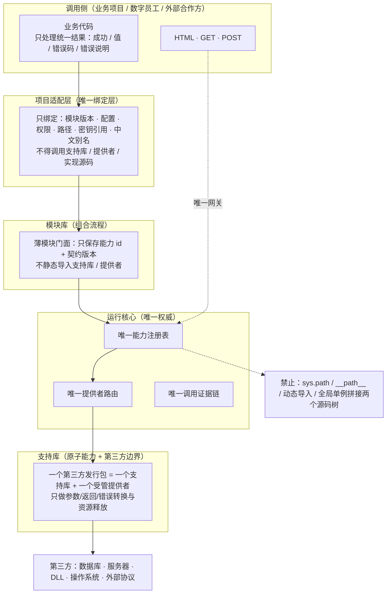
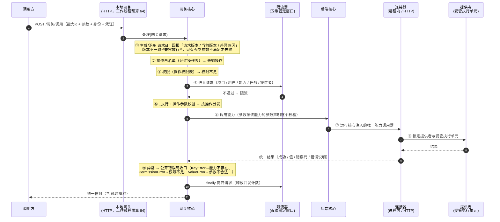
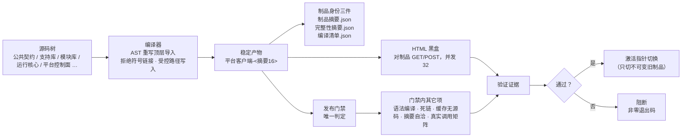
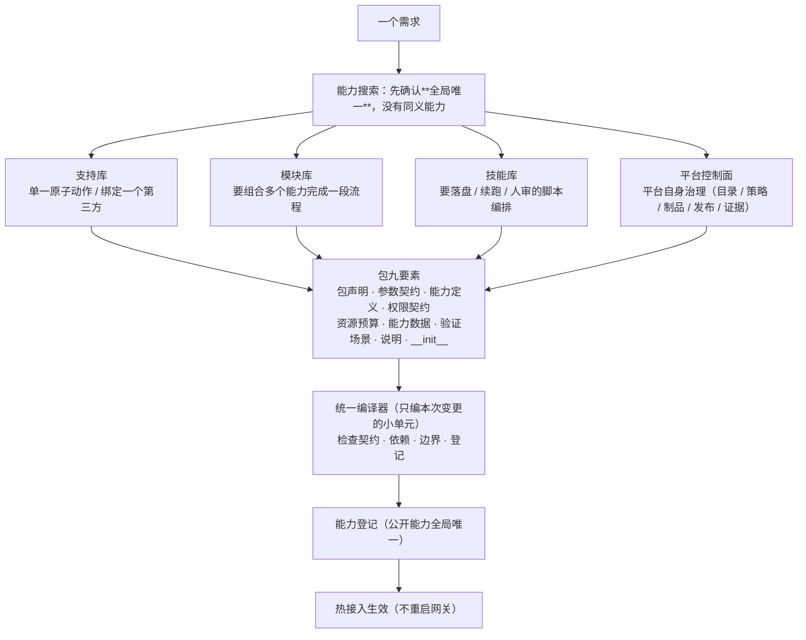
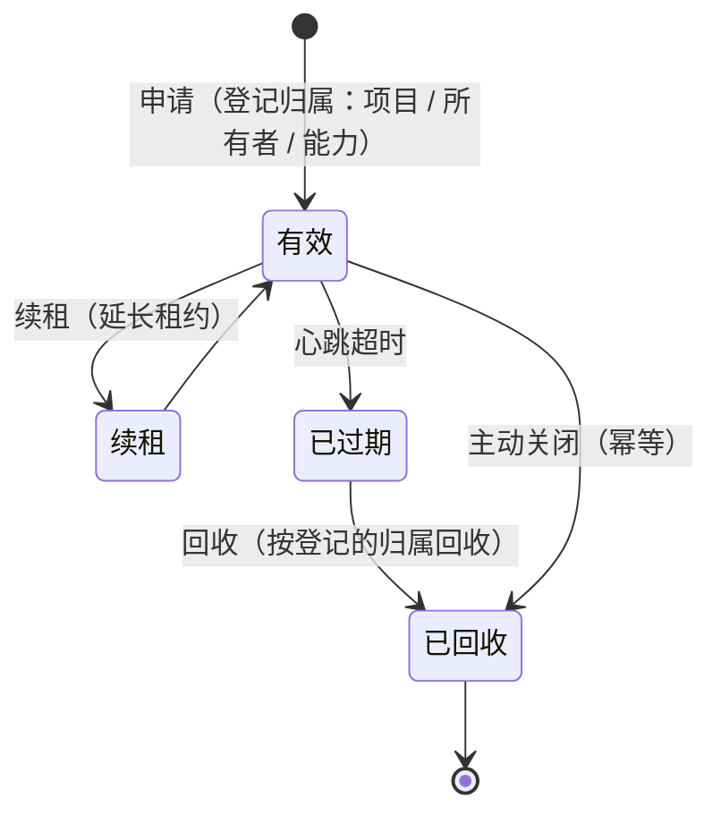

# 系统工程平台 · 架构总览（图）

> **这份文档只干一件事：用图讲清平台长什么样、一次调用怎么走、改变怎么上线。**
> 事实来源：`AGENTS.md`（唯一分层方案）、`运行核心/统一网关/网关核心.py:1150`（处理顺序）、
> `客户端/构建平台客户端.py`（编译链）。文字版细粒度流程见 `开发文档/当前流程图.md`。

---

## 一、平台是什么（一句话）

**一个与任何业务项目完全平级的系统级底座**：业务方不导入平台的任何实现，只经**唯一网关**按**能力 id** 调用；
平台内部怎么装、怎么路由、怎么换实现，业务方不感知。

---

## 二、分层与依赖方向

方向只有一个：**从上往下调用，绝不反向**。

**为什么这样切**（每条都对应一条硬规则）：

| 规则 | 目的 |
|---|---|
| 支持库只做原子能力，一个第三方包只归属一个支持库 + 一个受管提供者 | 换第三方只动一处 |
| 模块只组合能力 id，不静态导入支持库 | 支持库可单点升级，模块不用改 |
| 项目适配层只绑定版本/配置/权限/路径/密钥引用 | 换项目只改绑定，不动平台 |
| 运行核心只有一个注册表、一条路由、一条证据链 | 公开能力重复注册直接失败，避免"两条腿" |
| 第三方强制英文只留在适配层，业务语义一律中文 | 中文命名不影响换第三方 |

---

## 三、一次能力调用的真实全链路

下面是**代码里的真实顺序**（`网关核心.py::处理` → `_执行`），不是理想设计：

**读这张图要记住的三件事**：

1. **限流是"进入/离开"成对的**，`finally` 里必归还；不归还就会把并发额度吃死。
2. **参数校验发生在网关边界**，用的是能力自己声明的参数表 —— 没声明类型 = 没有可执行承诺，放行；**声明了就必须过**。
3. 所有底层异常都在网关收口成**公开错误码**，业务方永远看不到裸异常。

---

## 四、从源码到制品到验收

这是"改变怎么安全上线"的链路，也是本平台唯一的正式验收口径：

**三条硬约束**：

- **产物是不可变的**：验证时不许往制品里写任何东西（运行态走受管缓存）——
  这条正是"制品摘要前后不一致"要守的底线。
- **回滚只切指针**：换回旧制品即可，禁止恢复源码分支或翻转废弃标记。
- **验收只看真实 HTTP**：编译通过 ≠ 能用；必须经 HTML 黑盒对**已编译产物**发真实请求。

---

## 五、能力从哪来（四条路径）

**选层的唯一判据**（一句一条）：

- 一次调用就出结果 → **支持库**
- 要落盘 / 要续跑 / 要人审 → **技能库**
- 单一动作、不组合 → 支持库；**要组合** → 模块库

---

## 六、资源与失败（句柄体系）

长任务、文件、进程这类"有归属的资源"统一走**句柄**，不靠端口号或进程名盲杀：

- **回收按状态机登记的归属**，不按端口号盲杀 —— 这是硬规则。
- 重复关闭是**幂等**的（不提前失败）；句柄不存在才报「句柄无效」。

---

## 七、这张图对应的真实文件

| 图 | 权威文件 |
|---|---|
| 分层与依赖方向 | `AGENTS.md`「唯一分层方案」 |
| 一次调用全链路 | `运行核心/统一网关/网关核心.py`（`处理` / `_执行`）· `运行核心/统一网关/本地网关.py`（HTTP 线程预算） |
| 从源码到制品到验收 | `客户端/构建平台客户端.py` · `开发工具/HTML验证/` · `开发工具/发布门禁/运行发布门禁.py` |
| 能力四条路径 | `开发文档/规范/新建支持库与模块指南.md` · `新建技能包指南.md` |
| 句柄与资源回收 | `开发文档/规范/资源回收确认机制.md` · `公共契约/句柄体系.py` |

> 本文件是**图**（给人和外部读者看）；细到每个节点的入参/校验/出参/错误码的**文字版**在
> `开发文档/当前流程图.md`。两者不是第二事实源：冲突时以代码与决策记录为准。
