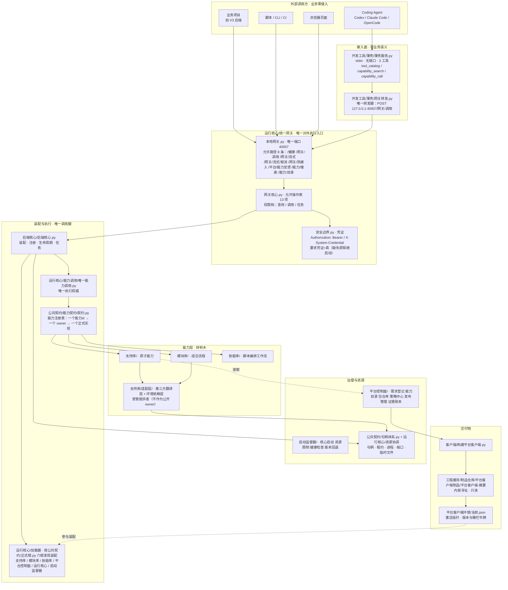
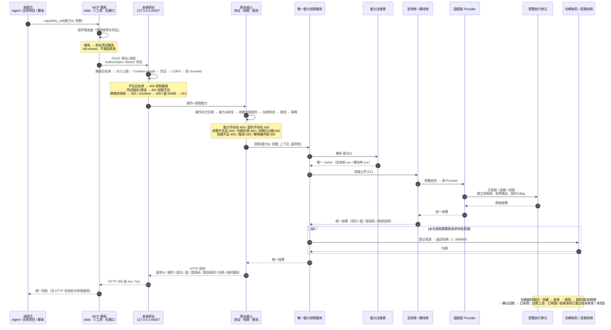
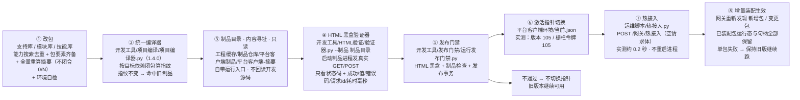
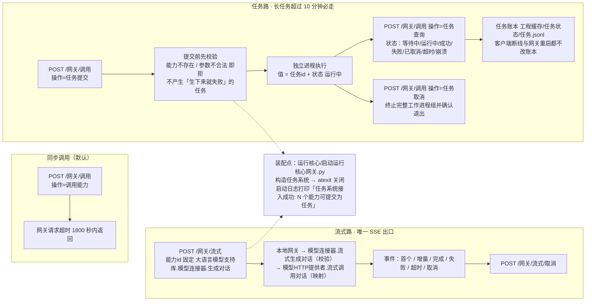
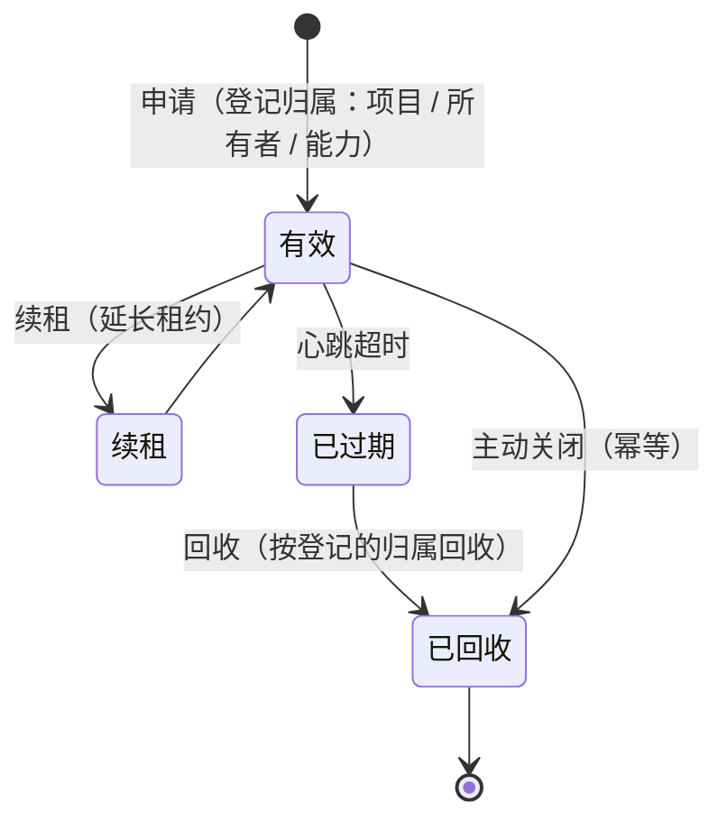

# 系统工程平台 · 架构总览（图）

> 最后更新：2026-09-26
> 口径：实测（数字随建包与提交逐日变化，引用前必须重跑取证命令）
> 维护者：图版架构

> **这份文档只干一件事：用图讲清平台长什么样、一次调用怎么走、改变怎么上线。**
> **每张图的每个节点都标了真实落点（文件:行号），不是示意图。**
> 事实来源：`AGENTS.md`（唯一分层方案）、`运行核心/统一网关/网关核心.py:1150`（处理顺序）、
> `公共契约/正式根.py:26`、`客户端/构建平台客户端.py`（编译链）。
> 文字版细粒度流程（逐节点入参/校验/出参/错误码）见 `开发文档/当前流程图.md`；两者不是第二事实源，冲突以代码与决策记录为准。
<!-- 机器管理｜类型：权威文档｜生成器：开发工具.MD文档生成 -->


**五张图**：① 分层架构 ② 一次能力调用全链路 ③ 源码→制品→发布→热接入 ④ 任务异步与流式链 ⑤ 句柄资源状态机

---

## 图 1 · 分层架构（静态结构）



**读这张图要记住的**：外部只经**接入面**进来（薄壳 stdio 无端口 / 唯一网关 40007），**没有第二条腿**；
能力层四类（支持库 / 模块库 / 技能库 / 适配层）定位各不同，**第三方只在适配层**。

---

## 图 2 · 一次能力调用的全链路（时序）



**三个关键点**：① 凭证 **fail-closed**（薄壳缺凭证直接不发起转发；网关 401）；
② 错误码在**网关边界**按契约收敛成公开状态码（404 / 400 / 403 / 429 / 409）；
③ 需要跨请求持有的资源走**句柄**，不靠进程名或端口号。

---

## 图 3 · 源码 → 制品 → 发布 → 热接入（交付流水线）



**三条硬约束**：① 制品**内容寻址且只读**，验证期间不许往里写任何东西（运行态走受管缓存）；
② 不通过就**不切指针**，旧版本继续可用；③ 热接入**不重启进程**，已装配包与句柄全部保留。

---

## 图 4 · 任务异步与流式链（文字版流程图缺失的两条）



**两条判据**：① 预计超过 10 分钟的任务**必须走任务路**（同步路网关超时 1800 秒）；
② 流式只有**一个 SSE 出口**，能力 id 固定。

---

## 图 5 · 句柄与资源状态机



**回收按状态机登记的归属**（项目 / 所有者 / 能力），**禁止按端口号盲杀**；
重复关闭幂等，句柄不存在才报「句柄无效」。

---

## 每张图对应的真实文件

| 图 | 权威文件 |
|---|---|
| 1 分层架构 | `公共契约/正式根.py:26`、`开发工具/薄壳/{薄壳服务.py, 网关转发.py}`、`运行核心/统一网关/{本地网关.py, 网关核心.py, 安全边界.py}` |
| 2 一次调用全链路 | `运行核心/统一网关/网关核心.py`（`处理` / `_执行`）、`本地网关.py`、`公共契约/HTTP路由契约.json` |
| 3 源码→制品→发布 | `客户端/构建平台客户端.py`、`开发工具/项目编译/项目编译器.py`、`开发工具/发布门禁/运行发布门禁.py`、`运维脚本/热接入.py` |
| 4 任务与流式 | `运行核心/任务调度/`、`运行核心/统一网关/传输/流式HTTP.py`、`运行核心/启动运行核心网关.py` |
| 5 句柄与回收 | `开发文档/规范/资源回收确认机制.md`、`公共契约/句柄体系.py`、`运行核心/资源协调/` |

---

## 附录 A · 底座七面缺陷落点索引（2026-09-26 深度审计）

> **本附录只回答三件事**：底座已核实的缺陷住在哪些**真实节点**上；每一面**被哪道门禁覆盖**、哪一面是**盲区**；外部成熟项目（易语言真源码 + 治理类开源）在这些点上怎么解、哪些**不该**抄。
> **不给数量、不给逐条明细、不给修法** —— 数量与逐条明细（含三列修法表）的唯一事实源是 `开发文档/未完成事项.md` 的「底座深度审计全量登记」段（债务清单，账目由生成器按正文实数算出，禁手改）。
> 取证命令（本文不写死任何会变的数字）：
>
> ```bash
> python3.14 -m 开发工具.MD文档生成 --类型 债务清单 --校验
> python3.14 -m 开发工具.开发编译口.编译口 --不跑点名 --全仓
> ```

### A.1 七面缺陷节点树（真实 `文件:行号` · 标父子归属）

```text
底座（唯一网关 :40007 ＋ 薄壳工具面）
│
├─① 装配/生命周期面 ──────────────── 运行核心/加载器/
│   ├─ 依赖解析/装配锁.py ···· 装配锁(17) 装配状态表(20) 差异说明(38) 构建(56) 读(81) 写(87) 清(93)
│   ├─ 管理器.py ············· 回滚(326)          ├─ 发现器.py ····· 枚举根(108)
│   └─ 公共契约/能力契约/契约.py ·· 能力注册表.注册(184) 调用(161)
│
├─② 失败面 ───────────────────── 错误通道
│   ├─ 公共契约/错误结构/错误结构.py ···· 码枚举(38-78) 子结构键(22-30)
│   ├─ 公共契约/错误结构/错误说明表.py ·· 码表(27-29)
│   ├─ 运行核心/统一网关/网关处理面.py ·· 判成功(165-190) 未知码文案(159-163)
│   ├─ 运行核心/统一网关/本地网关.py ···· 状态映射(567-569) 并发区间(624)
│   ├─ 运行核心/统一网关/协议/子进程协议.py · 重复码(50-52)
│   ├─ 运行核心/统一网关/忽略记录.py ···· deque(30-46)
│   ├─ 公共契约/运行时/仓库只读锁.py ···· 回锁(370-387)
│   └─ 运行核心/权威状态_可靠性面.py ···· WAL(83) 备份(96)
│
├─③ 传参面 ───────────────────── 参数进出
│   ├─ 公共契约/基础类型/类型规格.py ···· 校验(192) 必填(213) 放行(221)
│   ├─ 公共契约/基础类型/字段名册.py ···· 校验(440) 放行(448)
│   ├─ 公共契约/能力契约/数组文本.py ···· 展开(103-138) 空位(110) 放行(190)
│   ├─ 运行核心/统一网关/网关参数校验面.py · 归一(85/128)
│   ├─ 运行核心/统一网关/网关执行面.py ··· 忽略信号(149)
│   ├─ 运行核心/统一网关/唯一能力调用_调用参数.py · 未知键(67)
│   └─ 开发工具/能力定义编译器.py:343 ···· 契约编译器.py:76
│
├─④ 返回面 ───────────────────── 信封/截断
│   ├─ 公共契约/基础类型/结果类型.py ···· 信封(28) 无值(33/57)
│   ├─ 运行核心/统一网关/网关处理面.py ·· 上限(110)
│   ├─ 开发工具/薄壳/薄壳服务.py ······· 正文键(556) 去空值(526) 指针(852/1164) 终态(1340/1363) 句柄账(1398)
│   ├─ 开发工具/薄壳/工具清单.py ······· 预算(86) 上限(94)
│   ├─ 支持库/后端/文件系统.py ········· 精简(86/173) 截断提示(186)
│   └─ 运行核心/统一入口/核心.py ······· dumps(576)
│
├─⑤ 判据覆盖面 ────────────────── 编译口门禁
│   ├─ 开发工具/开发编译口/编译口.py ···· 门禁清单(99-259) 只报告(139/257)
│   ├─ 开发工具/规则自检.py ············ 判据①(188) 强制点(132)
│   ├─ 开发工具/运行状态监督/提供者.py ·· 审计依赖(118)
│   └─ 开发文档/规范/哲学总账.md ······· ⚠️纸面(154/161/300/324)
│
├─⑥ 并发资源面 ────────────────── 上限/无界增长
│   ├─ 启动监督器/容量基线.py ·········· 字段(23) 基线(137/155/176) 证据(212)
│   ├─ 运行核心/自适应选型/档位表.py ···· 第二份(121)   ← 与上者「双向够不到」
│   ├─ 运行核心/统一网关/超时治理.py ···· deque(54)    ├─ 超时执行/基础.py · 线程(29)
│   ├─ 运行核心/环境管理器.py ·········· 锁表(295)     ├─ 句柄体系.py ···· 扫描缺(604)
│   ├─ 运行核心/句柄服务.py ············ 统计(35/61)
│   ├─ 运行核心/统一网关/网关幂等面.py ·· FIFO 丢弃(114)
│   └─ 运行核心/排空管理.py ············ 排空(25)
│
└─⑦ 制品上线面 ────────────────── 构建/激活/回滚
    ├─ 客户端/构建平台客户端.py ········ 可复现(407-423) 豁免(436) 非文本(430) 扰动(417) 摘要(237)
    ├─ 开发工具/项目编译器.py ·········· 版本硬编码(46) 缓存键(214) 目录锁(640/770) 来源(761)
    ├─ 开发工具/平台客户端制品.py ······ 稳定路径(358/362) 崩溃(428)
    ├─ 开发工具/发布管理/服务.py ······· 回滚(201) 世代缺(86)
    ├─ 开发工具/制品保留.py ············ mtime(165/179)
    ├─ 开发工具/制品验证.py ············ 落后(510) 指纹(199)
    ├─ 开发工具/制品生成与自校验.py ···· 来源(249)
    └─ 开发工具/制品新鲜度门禁.py ······ 只报告(29)
```

### A.2 覆盖关系：哪一面有门禁、哪一面是盲区

| 面 | 编译口门禁覆盖情况 | 缺口性质 |
|---|---|---|
| ① 装配/生命周期 | **零门禁** | 装配锁跨进程、幂等漂移无判据 |
| ② 失败 | 部分（错误码枚举/文案在门禁内） | 静默吞错无判据 |
| ③ 传参 | 有（参数可用性 / 参数口径 / 契约漂移） | 类型校验四处并存、放行三处 |
| ④ 返回 | 部分（超限指针化在薄壳内） | 信封四套并存无判据 |
| ⑤ 判据覆盖 | **本面即门禁自身** | 依赖防火墙**不在门禁清单**（只在注释） |
| ⑥ 并发资源 | **零门禁** | 上限多处各写、无界容器无判据 |
| ⑦ 制品上线 | 有但**只报告**（制品新鲜度） | 可复现校验自指 |

**盲区清单**（有实现、但两处门禁都不调）：`依赖防火墙.审计依赖`、`运行状态监督.审计依赖`、包体检、门面核验、跨平台部署验证、模块合规、错误码文案派生、**单腿铁律**（本条至今无判据）。

**只报告清单**（本该阻断，现按存量只报告）：`测试伪装门禁`、`写入凭证透传`、`md查重`、`制品新鲜度`。

### A.3 外部借鉴：可抄 / 别抄（架构范式，行号取证见 `未完成事项.md` 同段）

**易语言真源码可抄**：① 单一固定入口 + 静态描述表（DLL 只导出一个符号）→ 我方 `支持库安装.py` 的 `getattr` 猜入口应改「唯一入口返回声明表」；② **返回槽与参数分离 + 显式「有值位」** → 直接解我方「成功但无值」三态；③ **DETACH/DELETE 分离 + 幂等解绑** → 句柄释放应拆「摘索引」与「释放内存」两阶段，禁悬挂 id；④ 运行时托管分配器跨边界 → 跨进程传值统一所有权；⑤ 失败统一 cleanup（异常兜底 + 析构自动释放）。

**易语言明确别抄**：① 二值错误码 + 只带 `char*` 的错误通道（错误不可编程处理）；② 手写平行数组 + 注释当约束（无编译期保障）；③ **两个语义共用一个标志位**（类型标签自身不可自解释，是 ABI 级歧义）；④ 文档与实现相反；⑤ 引用了却从未定义的通知码；⑥ 底座 71 份复制粘贴。

**治理类开源可抄**：① archunit「**空扫描面即失败**」+ 覆盖率断言 → 依赖防火墙加「文件数==0 即失败」；② tach「**未使用豁免即报** + 豁免必须写理由」→ 我方豁免表加「零命中即报」；③ dependency-cruiser 违规带**路径链** + 四级严重级别 → 回执加链与级别；④ pre-commit「**声明了必须真能命中**」元钩子 → 编译口每项加「最小扫描面」；⑤ conftest `--fail-on-warn` **三态开关** → 只报告项改「审计 + 存量上限 + 到期转阻断」；⑥ mutmut 强制失败自检 + cosmic-ray 算子黄金样例 + OPA 覆盖率阈值 → 规则自检加「每条判据一条反向夹具」。

**治理类明确别抄**：① **kyverno 默认 Audit + 非计分 `fail→warn` 降级** —— 这正是我方「只报告本该阻断」的上游成因；② pre-commit 二态无超时；③ archunit `FreezingArchRule`「首次运行永远通过」（与 fail-closed 冲突）；④ import-linter 纯配置无代码 DSL（口径外置增加跨文件解析面）；⑤ mutmut 把 timeout 计入杀死、cosmic-ray 把 INCOMPETENT 算杀死（分数虚高）；⑥ in-toto/sigstore/slsa 依赖在线透明日志与 TUF（离线单机即网络单点）。

### A.4 本附录的边界

- 本附录是**落点索引**，不是第二事实源：与 `未完成事项.md` 同段冲突时以那里为准（那里有行号取证与修法列）。
- 本附录**不记录已修状态** —— 按 `Markdown 文档体例规范`「已修条目直接删」，条目修完即从 `未完成事项.md` 删除，本附录只保留「面」与「节点」的稳定骨架。
- 七面之外尚未覆盖的面（数据/sqlite、权限授权、进程生命周期、网络传输、可观测与脱敏、序列化编解码、配置、测试体系、代码地图索引、能力目录注册表、跨平台、单腿铁律、依赖供应链、模块与包契约、发布世代）**正在审计中**，结论并入后再补入 A.1。
