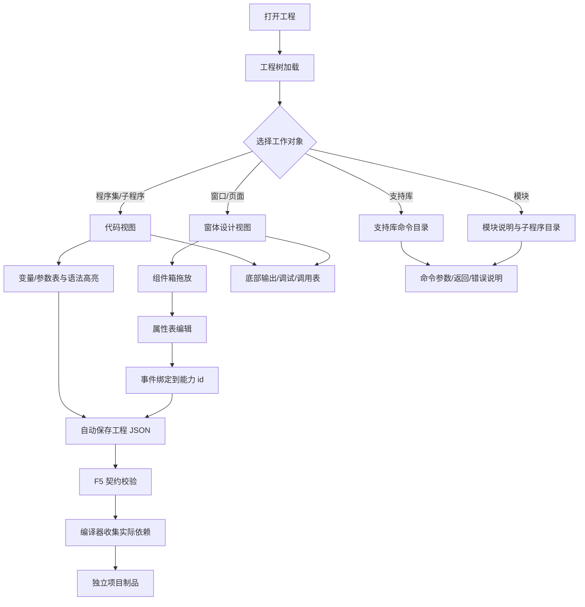

# 轻代码前端 IDE 规范（截图对照草案）

> 状态：待确认，不直接替代现有实现。  
> 参考来源：`开发文档/参考截图/易语言IDE/` 下 8 张易语言 IDE 截图。  
> 目标：保留易语言“工程树 + 支持库 + 组件拖放 + 属性表 + 代码/窗体双视图”的操作方式，底层实现仍使用本平台的 JSON 契约、支持库、模块库和运行核心。

## 总体流程



## 一、截图确认的固定布局

### 1. 工程代码视图

截图：

- `07ac3dd5766f806e6e751b73db192259.png`
- `看他的程序的代码，是怎么轻量化显示的，后端怎么实现无所谓，但是这个 IDE 可以这么显示.png`
- `这个看左侧的那个程序集，就是实际代码有什么东西的，然后展示出来.png`

固定区域：

```text
┌ 菜单栏：文件 编辑 查看 插入 数据库 运行 编译 工具 窗口 帮助 ┐
├ 工具栏：新建 打开 保存 撤销 重做 运行 停止 调试/视图切换      ┤
├ 左侧工程树 ─────────┬──────────── 中央代码编辑区 ────────────┤
│ 程序集              │ 行号、折叠、语法颜色、当前执行箭头       │
│  ├ 子程序           │ 子程序签名表                             │
│  ├ 窗口事件         │ 参数表、变量表、代码                     │
│  ├ DLL/模块引用     │                                          │
│  ├ 窗口             │                                          │
│  ├ 常量表           │                                          │
│  ├ 资源表           │                                          │
│  └ 模块引用表       │                                          │
├ 支持库/程序/属性页签 ┴ 底部输出、调用表、监视表、变量表、搜索 ┤
```

确认的操作特征：

1. 左侧树不是装饰，它是实际代码导航入口；窗口事件会直接展开成大量子程序。
2. 中央代码不是普通文本编辑器。子程序签名、参数、变量、返回值以表格形式内嵌显示。
3. 代码颜色有明确语义：关键字/命令、字符串、注释、返回值、类型、可点击符号分别着色。
4. 底部输出区长期固定，不因切换代码或窗体而消失。

### 2. 窗体设计视图

截图：`这个是拖动组件的，你可以看看结构.png`

```text
┌ 菜单/工具栏                                                     ┐
├ 左侧属性表 ──────────┬──────────── 窗体画布 ────────┬ 组件箱 ──┤
│ 当前对象              │ 可拖动、可缩放、可嵌套的窗口 │ 基本组件 │
│ 名称                  │ 页面/窗口真实预览             │ 扩展组件 │
│ 位置/尺寸              │                               │ 组件图标 │
│ 可视/禁止/字体/颜色    │                               │          │
├ 支持库/程序/属性页签   ┴──────────── 底部输出 ─────────┴─────────┤
```

确认的操作特征：

1. 左侧属性表是主编辑入口，不要求用户打开复杂设置弹窗。
2. 右侧组件箱用图标网格展示组件；“基本组件”和“扩展组件”分组。
3. 组件被拖到窗体后，属性表立即切换到该组件。
4. 窗体、组件、子组件必须有明确的父子关系，不能只保存一组平面坐标。

### 3. 支持库视图

截图：`这个主要看他的变量参数显示（类似于这样子显示），然后左侧是有系统核心支持库的，我记得之前有下载过易语言官方的那个的。大概这么显示.png`

左侧显示支持库分类和命令树，例如：流程控制、逻辑比较、变量操作、数据操作、环境存取、文本操作、时间操作、数值操作、数组操作、文件读写、系统处理、媒体播放、窗口操作、数据库、网络通信、控制台操作等。

中央显示命令使用上下文：

```text
命令名（返回类型）
参数名       类型       参考/可空/数组       默认值       备注
返回值       类型
```

这里的表格由支持库的能力契约自动生成，不能由 IDE 另写一份参数定义。

### 4. 模块查看视图

截图：

- `这个也是双击打开模块的，他是分子程序和类的。这个你自行看看吧.png`
- `这个点击模块之后，IDE 显示模块的内容，主要看这个.jpg`

双击模块后打开模块信息窗口：

```text
左栏：模块名
  ├ 子程序
  │  ├ 命令一
  │  ├ 命令二
  │  └ 命令三
  └ 类
     ├ 类方法
     └ 类属性

右栏：模块名称、作者、版本、说明、公开子程序、参数和返回类型
```

模块是组合能力的发布单元。IDE 只读取其公开契约，不加载模块内部实现源码。

## 二、唯一工程数据模型

IDE 编辑的唯一事实源是工程目录中的 JSON，不以 HTML、临时 DOM 或截图作为源文件。

```json
{
  "契约版本": "1.0.0",
  "工程": {
    "工程id": "示例工程",
    "项目类型": "软件项目",
    "启动对象": "窗口1"
  },
  "程序集": [],
  "窗口": [],
  "支持库引用": [],
  "模块引用": [],
  "资源": []
}
```

窗口组件必须使用树形结构：

```json
{
  "组件id": "编辑框1",
  "类型": "编辑框",
  "父组件id": "容器1",
  "属性": {
    "名称": "编辑框1",
    "文本": "",
    "占位文本": "请输入",
    "左": 12,
    "上": 12,
    "宽度": 220,
    "高度": 32
  },
  "事件": [
    {"名称": "输入", "能力id": "能力.状态更新"}
  ]
}
```

## 三、工作视图和最小操作

| 工作视图 | 进入方式 | 用户主要操作 | 不应要求用户处理 |
|---|---|---|---|
| 代码视图 | 双击程序集/子程序 | 编写中文代码、查看参数/变量表、跳转 | HTML、JavaScript、底层导入 |
| 窗体视图 | 双击窗口 | 拖组件、移动、嵌套、改属性、绑定事件 | 手写布局 JSON |
| 支持库视图 | 点击支持库 | 搜索命令、查看参数/返回/错误 | 第三方包名和内部类 |
| 模块视图 | 双击模块 | 查看公开子程序和类、插入调用 | 模块内部实现路径 |
| 运行视图 | F5 | 契约检查、编译、启动预览 | 手动拼依赖目录 |

默认原则：点击选择，双击打开/编辑，拖动改变位置，右侧或左侧属性表修改属性，所有改动自动保存。

## 四、支持库与模块在 IDE 中的边界

### 支持库

- 左侧以“系统核心支持库、前端组件支持库、外部服务支持库”等分类展示。
- 每个支持库只提供原子能力、参数/返回/错误和句柄生命周期。
- IDE 显示的是 `能力契约/`，不是实现目录。
- 缺少支持库时，调用和编译必须显示明确错误，不显示空白成功。

### 模块

- 模块只组合公开能力，提供工作流、类、子程序和说明。
- 模块引用只记录模块 id 和契约版本。
- 模块详情窗口必须列出公开子程序、参数、返回值、可见性和版本。
- 模块不能直接导入第三方包，也不能绕过统一能力调用器。

## 五、自动生成的代码辅助显示

代码编辑器需要把以下信息作为结构化显示层：

1. 行号和折叠标记。
2. 子程序签名表：子程序名、返回值类型、公开/私有、易包、备注。
3. 参数表：参数名、类型、参考、可空、数组、备注、默认值。
4. 变量表：变量名、类型、静态、数组、备注。
5. 命令悬浮说明：来源支持库、参数、返回、错误码和示例。
6. 能力调用跳转：从代码中的能力 id 跳转到支持库契约。

这些表格由 JSON 契约生成，用户可以直接在代码中调用，但不需要重复声明一份参数说明。

## 六、自动保存与运行

1. 用户停止输入或拖动约 0.5 秒后自动保存。
2. 保存采用临时文件写入、完整 JSON 校验、原子替换。
3. 保存状态必须明确显示“正在保存 / 已自动保存 / 保存失败”。
4. F5 先做结构、父子关系、引用和能力存在性校验。
5. 编译器只收集实际使用的支持库和模块，生成独立项目目录。
6. 运行失败显示结构化错误码和来源节点，禁止空白页面或假成功。

## 七、第一版验收清单

- [ ] 工程树可展开程序集、窗口、支持库、模块、资源。
- [ ] 双击程序集子程序进入代码视图。
- [ ] 双击窗口进入窗体设计视图。
- [ ] 组件箱按基本组件/扩展组件分组，支持拖入。
- [ ] 组件可移动、可调整尺寸、可嵌套到容器。
- [ ] 属性表可编辑名称、文本、位置、尺寸、可视、禁止、字体和颜色。
- [ ] 支持库命令能显示参数、返回值、错误和示例。
- [ ] 模块窗口能显示子程序/类树和公开契约。
- [ ] 底部输出、调用表、监视表、变量表、搜索页签可切换。
- [ ] 自动保存真实落盘，重启 IDE 后工程结构不丢失。
- [ ] F5 能阻断缺失能力、无效父组件和契约版本不匹配。

## 八、当前实现与本规范的差距

当前实现状态：基础功能已执行，前端与工程模型持续按本文件规格维护；当前无已确认的未完成债务。若发现新差距，先登记到`开发文档/未完成事项.md`，再按本文件协议维修。

## 九、唯一值与多源编辑一致性（核心机制）

### 9.1 名称不是身份

截图中可以看到大量“窗口1、按钮A_被单击、程序集、子程序、模块命令”等显示名称。它们都只是用户可读名称，不能作为唯一引用。

所有可被引用、编辑、运行或审计的对象必须有不可变的 `对象id`。名称可以修改，`对象id` 不得因重命名、移动、换视图而改变。

| 对象 | 唯一字段 | 显示字段 | 说明 |
|---|---|---|---|
| 工程 | `工程id` | 工程名称 | 一个工程的根身份 |
| 页面/窗口 | `页面id` | 标题、名称 | 代码视图和窗体视图共同引用 |
| 组件 | `对象id` | 名称、文本 | `组件id` 只能作为兼容显示别名，不能作为长期身份 |
| 程序集 | `程序集id` | 程序集名称 | 代码树节点身份 |
| 子程序/类/方法 | `成员id` | 子程序名、类名 | 代码跳转和模块公开契约引用 |
| 变量/参数 | `符号id` | 变量名、参数名 | 改名时保留引用关系 |
| 支持库 | `包id` | 包名称 | 绑定包版本和摘要 |
| 原子能力 | `能力id` | 中文名称 | 全平台唯一能力入口 |
| 模块 | `模块id` | 模块名称 | 模块公开契约身份 |
| 事件 | `事件id` | 事件名称 | 组件事件与能力绑定身份 |
| 资源 | `资源id` | 文件名 | 图片、字体、静态文件身份 |
| 修改操作 | `操作id` | 操作说明 | 多源编辑审计和幂等身份 |
| 工程修订 | `修订id` | 修订号、时间 | 每次权威提交的版本身份 |

推荐的 `对象id` 形态为带前缀的随机唯一值，例如 `组件_01J...`、`页面_01J...`。前缀用于诊断，不能由显示名称拼接生成。

### 9.2 一个权威模型，多个物理投影

工程可以拆成多个 JSON 文件以便加载和协作，但只能有一个逻辑权威模型：

```text
工程目录/
├── 工程模型/
│   ├── 工程索引.json              # 工程id、当前修订、对象目录、入口
│   ├── 对象.json                  # 页面、窗口、组件、程序集、成员关系
│   ├── 符号.json                  # 变量、参数、事件和引用关系
│   └── 引用.json                  # 支持库、模块、能力、资源引用
├── 编辑记录/
│   ├── 操作日志.jsonl             # 操作id、来源视图、基准修订、结果修订
│   └── 修订摘要.jsonl             # 每次提交的摘要和变更对象
├── 视图缓存/
│   ├── 代码视图.json              # 从工程模型生成，可删除重建
│   ├── 窗体视图.json              # 从工程模型生成，可删除重建
│   └── 支持库目录.json            # 从包声明/能力契约生成，可删除重建
└── 资源/
```

`视图缓存/` 不能被当成第二份事实源。代码视图、窗体视图、模块窗口和属性表显示的都是同一批对象，只是投影方式不同。

### 9.3 所有修改都必须经过统一操作

视图不得直接改 DOM 后写文件，也不得直接修改某个局部 JSON。所有编辑都转换为公共操作：

```json
{
  "操作id": "操作_01J...",
  "工程id": "工程_01J...",
  "来源视图": "窗体设计器",
  "基准修订号": 42,
  "目标对象id": ["组件_01J..."],
  "操作": "设置属性",
  "路径": ["属性", "文本"],
  "旧值摘要": "sha256:...",
  "新值": "请输入姓名",
  "客户端时间": "2026-08-22T12:00:00+08:00"
}
```

最小操作集合：

- `新增对象`
- `删除对象`
- `重命名对象`
- `设置属性`
- `移动对象`
- `调整尺寸`
- `建立父子关系`
- `解除父子关系`
- `绑定事件`
- `解除事件绑定`
- `新增引用`
- `删除引用`
- `移动代码成员`

权威编辑服务按以下顺序处理：校验目标对象 → 校验基准修订 → 校验路径和类型 → 校验父子关系/引用 → 写入操作日志 → 生成新修订 → 原子更新工程模型 → 重建受影响视图。

### 9.4 多源修改的冲突规则

不能用“最后写入者覆盖”解决冲突，因为代码视图和窗体视图可能同时修改同一组件。

| 情况 | 处理 |
|---|---|
| 基准修订等于当前修订 | 正常提交，生成新修订 |
| 修改不同对象 | 可自动合并，仍生成一个操作记录 |
| 修改同一对象的不同属性路径 | 可自动合并，例如代码改事件、窗体改位置 |
| 修改同一对象的同一路径 | 拒绝后返回冲突对象、当前值、提交者和修订号 |
| 父容器已被删除 | 拒绝，不能自动挂到页面根节点 |
| 能力/模块版本已变化 | 按契约版本校验；不兼容时阻断编译 |
| 重复操作 id | 返回第一次操作结果，不产生第二次修改 |

冲突响应必须是结构化数据：

```json
{
  "成功": false,
  "错误码": "编辑冲突",
  "对象id": "组件_01J...",
  "路径": ["属性", "文本"],
  "基准修订号": 42,
  "当前修订号": 43,
  "当前值": "服务器地址",
  "提交值": "数据库地址",
  "解决方式": ["保留当前值", "使用提交值", "打开差异" ]
}
```

禁止静默丢弃任一来源的修改，禁止把冲突显示成“保存成功”。

### 9.5 各视图如何显示同一对象

```text
工程模型中的对象id
        ├── 程序集树：显示名称/类型，点击跳转成员id
        ├── 代码视图：显示成员id对应的签名、变量表、代码行
        ├── 窗体视图：显示页面id下的组件树和父组件id
        ├── 属性表：编辑对象id的属性路径
        ├── 支持库视图：显示包id/能力id的中文契约
        └── 模块窗口：显示模块id及其公开成员id
```

代码中的变量名、组件名称和模块命令名称都可以改，但编辑器内部跳转、事件绑定、能力调用和编译依赖始终使用 id。

### 9.6 删除、移动和恢复

1. 删除对象必须记录 `删除操作id` 和完整对象快照，支持撤销；不能只从数组中移除一行。
2. 删除容器前必须列出子对象；默认要求用户确认“连同子对象删除”或“移动子对象”。
3. 移动对象只改变父对象和布局路径，不改变对象 id。
4. 撤销和重做本质上是提交反向操作，不直接回写旧 JSON。
5. 崩溃恢复读取最后一个完整修订；临时文件、半写入文件和孤立操作必须被拒绝并保留诊断。

### 9.7 对当前实现的直接结论

对象身份、父子关系和多源工程模型的目标契约由本文件定义；当前无已确认的未完成债务。若新代码与对象模型不一致，必须先登记`开发文档/未完成事项.md`，再按对象id/CAS协议修复。

## 十、Agent、网关和批量工具也是编辑源

### 10.1 统一原则

IDE、Agent、命令行、迁移脚本、代码生成器、批量重命名工具和未来的远程协作客户端，都是同一种角色：**工程编辑客户端**。

它们不能各自拥有一套“保存工程”的实现，也不能因为是 Agent 就绕过 IDE 规则直接覆盖 `工程模型/`。所有写入必须进入同一个工程编辑网关，由同一个权威编辑服务裁决。

```text
IDE 窗体视图 ─┐
IDE 代码视图 ─┤
IDE 模块视图 ─┤
Agent         ─┤──> 工程编辑网关 ──> 权威工程模型/CAS提交 ──> 视图投影
命令行工具    ─┤          │
迁移/生成器    ─┘          ├── 操作日志
                           ├── 修订摘要
                           ├── 权限与写入范围
                           └── 验证与冲突证据
```

“Agent 通过网关编辑”不等于“Agent 可以直接执行任意代码”。Agent 只提交结构化工程操作；能力执行仍走统一能力调用器，第三方调用仍由支持库/提供者边界负责。

### 10.2 Agent 编辑的六步协议

```text
读取工程摘要/当前修订
       ↓
查询对象、能力、模块和引用（只读）
       ↓
生成变更计划（操作列表 + 目标对象 id + 影响范围）
       ↓
网关预览/契约校验（不改变权威模型）
       ↓
带授权租约提交操作（CAS + 幂等操作 id）
       ↓
读取新修订、差异、验证结果和剩余风险
```

Agent 不允许使用“读全量 JSON → 修改本地副本 → 整文件上传”的接口。唯一允许的写入形态是操作列表：

```json
{
  "请求id": "请求_01J...",
  "工作id": "工作_01J...",
  "工程id": "工程_01J...",
  "基准修订号": 42,
  "来源": "Agent",
  "目的": "将登录按钮绑定到用户登录能力",
  "操作列表": [
    {
      "操作id": "操作_01J...",
      "操作": "绑定事件",
      "目标对象id": "组件_01J...",
      "事件id": "事件_01J...",
      "能力id": "用户.登录",
      "参数模板": {}
    }
  ],
  "提交模式": "预览"
}
```

预览成功只代表操作在当前快照上可应用，不能当作已经写入。只有 `提交模式=提交` 且网关返回新 `修订号`，才算权威变更完成。

### 10.3 Agent 的权限和写入范围

Agent 的身份、工作 id、允许修改目录和资源范围必须由网关会话绑定，不能由请求正文自报后获得权限。

| Agent 操作 | 默认权限 | 是否改权威模型 |
|---|---:|---:|
| 查询工程/对象/契约 | 只读 | 否 |
| 生成变更计划 | 只读 | 否 |
| 预览变更 | 只读验证 | 否 |
| 提交页面属性/布局 | 受限写入 | 是 |
| 提交代码/模块变更 | 受限写入 | 是 |
| 执行 F5 验证 | 执行权限 | 否，产生验证证据 |
| 提交候选制品 | 发布前权限 | 写候选制品，不切换正式指针 |
| 发布/回滚 | 发布者权限 | 是，必须经过发布门禁 |

Agent 默认只能修改任务信声明的工程、对象类型和路径。超出范围必须返回权限错误，不自动扩大范围；任务结束时租约失效，未提交草稿自动变为不可提交状态。

### 10.4 多个 Agent 同时编辑

多个 Agent 不通过互相覆盖解决并发。网关按 `工程id + 目标对象id + 属性路径` 做短锁和 CAS：

1. 不同对象可并行预览和提交。
2. 同一对象不同属性路径可以合并，但必须写入同一修订的多个操作记录。
3. 同一对象同一路径只允许一个提交成功，另一个得到结构化冲突。
4. 大范围重构必须申请工程级租约，期间其他写入返回“资源被占用”，而不是排队无限等待。
5. Agent 崩溃、超时或失联后，租约自动回收；已提交修订保留，未提交操作不进入权威模型。

### 10.5 Agent 生成代码和 IDE 显示代码的关系

Agent 可以生成或修改代码，但代码文本不能成为唯一事实。每个代码成员和关键语句必须有稳定 id：

```json
{
  "成员id": "成员_01J...",
  "名称": "用户登录",
  "返回类型": "逻辑型",
  "语句": [
    {"语句id": "语句_01J...", "操作": "调用能力", "能力id": "用户.登录"},
    {"语句id": "语句_01J...", "操作": "返回", "值": true}
  ]
}
```

代码编辑器显示的是这些成员和语句的文本投影；Agent 的重排、重命名和补充说明都通过 id 定位。纯文本差异只作为辅助展示，不能作为最终冲突判断依据。

### 10.6 网关返回必须让 Agent 能继续工作

每次提交必须返回：

- 成功/失败；
- 新修订号或当前修订号；
- 实际变更对象 id 和路径；
- 结构化差异；
- 验证结果；
- 冲突对象和解决建议；
- 操作日志 id、请求 id、工作 id；
- 未完成的资源释放/租约状态。

禁止只返回“保存成功”或一段自然语言。Agent 没有这些字段就无法可靠地继续下一轮，也无法判断自己是否产生了假绿。

### 10.7 直接落点

要让这套机制真正可开发，底座需要增加一个唯一公开入口（名称可后续冻结）：

```text
工程.读取摘要(工程id) -> 当前修订、对象目录、引用摘要
工程.查询对象(工程id, 对象id) -> 对象及其来源修订
工程.预览变更(工程id, 基准修订号, 操作列表) -> 差异、冲突、验证结果
工程请求(操作=提交变更, 工程id, 基准修订号, 操作列表, 授权租约) -> 新修订、日志、验证
工程.查询修订(工程id, 修订号) -> 快照摘要和操作列表
工程.撤销操作(工程id, 操作id, 授权租约) -> 反向操作的新修订
工程.重建视图(工程id, 视图类型) -> 可验证的投影文件
```

IDE 和 Agent 都只调用这些入口；不存在“IDE 自己保存一套、Agent 直接改另一套、编译器再猜第三套”的并行事实源。

当前轻代码编辑器唯一写入口是受内部标记保护的 `POST /内部/工程请求`，请求以 `操作=提交变更` 携带 `工程id`、`基准修订号`、`请求id`、`来源` 和 `操作列表`。服务端补齐对象身份，使用修订号 CAS 原子提交，成功返回 `新修订号`，旧修订返回 HTTP 409 `编辑冲突`，并写入同目录 `编辑记录.jsonl`。旧 `/工程/请求` 返回 404，缺少 `X-Internal-Call: 1` 返回 403；读取、预览、提交和编译均使用这一入口，不保留第二套保存语义。
